# Subconsultas en T-SQL. Caso Sonora

Sesión 11. Ejecución de los ejemplos de la clase sobre SQL Server 2025 con la base de datos SonoraDB.

- Autor: Álvaro García-Quismondo Lizana
- Programa: Máster en IA y Big Data, Tajamar
- Entorno: SQL Server 2025 (17.0), SSMS 22
- Base de datos: SonoraDB, nivel de compatibilidad 170
- Fecha: 6 de octubre de 2026

Estructura de la carpeta:

```text
.
├── README.md
├── Subconsultas_Sonora_Sesion11.pdf
├── img/    capturas numeradas por figura
└── sql/    scripts numerados en orden de ejecución
```


## 1. Preparación del entorno

Antes de ejecutar los ejemplos preparé la instancia local de SQL Server y creé la base de datos SonoraDB, que se utiliza en las sesiones de SQL del curso.


### 1.1 Versión del motor

Conecté SSMS 22 a la instancia local y consulté la versión del motor con `@@VERSION` y `SERVERPROPERTY('ProductMajorVersion')`. La versión principal es 17, que corresponde a SQL Server 2025 (Figura 1). El Explorador de objetos muestra la instancia como `localhost (17.0.1135.8)`.

```sql
SELECT @@VERSION AS version_completa,
       SERVERPROPERTY('ProductMajorVersion') AS version_principal;
```

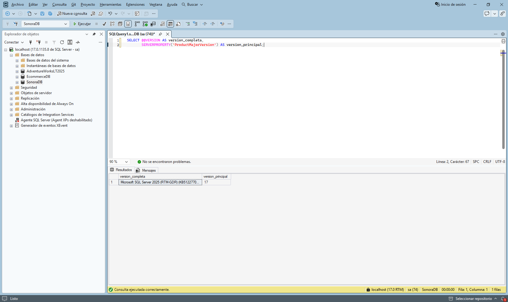

*Figura 1. Versión del motor: SQL Server 2025, versión principal 17.*


### 1.2 Creación de la base de datos

El script borra SonoraDB si ya existe, la vuelve a crear y fija el nivel de compatibilidad en 170 de forma explícita, porque una base creada en una instancia actualizada podría heredar un nivel anterior de `model`. La consulta final sobre `sys.databases` devuelve SonoraDB con nivel 170 (Figura 2).

```sql
USE master;
GO

IF DB_ID(N'SonoraDB') IS NOT NULL
BEGIN
    ALTER DATABASE SonoraDB SET SINGLE_USER WITH ROLLBACK IMMEDIATE;
    DROP DATABASE SonoraDB;
END;
GO

CREATE DATABASE SonoraDB;
GO

ALTER DATABASE SonoraDB SET COMPATIBILITY_LEVEL = 170;
GO

SELECT name, compatibility_level
FROM sys.databases
WHERE name = N'SonoraDB';
GO
```

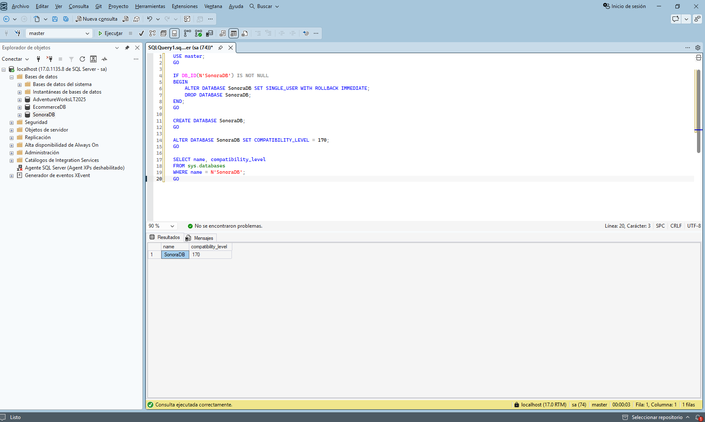

*Figura 2. Creación de SonoraDB con nivel de compatibilidad 170.*


### 1.3 Creación de las tablas

Creé ocho tablas con `sql/03_tablas.sql`: cinco del dominio musical, dos de staging sin restricciones, que reciben los datos tal como llegan, y una de empleados cuya columna `jefe_id` apunta a su propia clave primaria. Los comandos se completaron sin errores (Figura 3). La Tabla 1 resume el contenido de cada una.

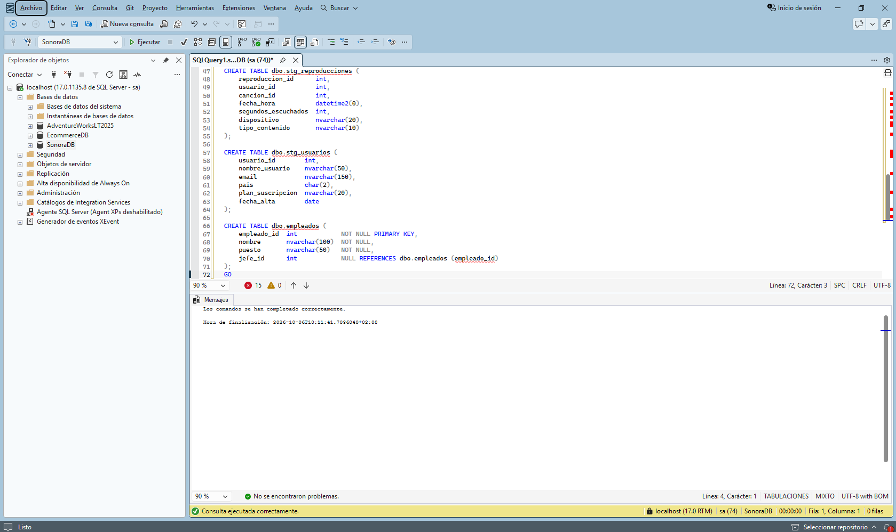

*Figura 3. Creación de las ocho tablas sin errores.*

*Tabla 1. Tablas de SonoraDB y filas tras la carga inicial.*

| Tabla | Contenido | Columnas | Filas |
|---|---|---|---|
| generos | Jerarquía de géneros musicales | genero_id, nombre, genero_padre_id | 13 |
| artistas | Artistas con país y género | artista_id, nombre, pais, genero_id | 9 |
| canciones | Catálogo de canciones | cancion_id, titulo, artista_id, genero_id, duracion_seg, fecha_lanzamiento | 15 |
| usuarios | Usuarios y plan de suscripción | usuario_id, nombre_usuario, email, pais, plan_suscripcion, fecha_alta | 8 |
| reproducciones | Reproducciones de canciones y anuncios | reproduccion_id, usuario_id, cancion_id (admite NULL), fecha_hora, segundos_escuchados, dispositivo, tipo_contenido | 33 |
| stg_reproducciones | Staging de reproducciones, sin restricciones | Las mismas columnas que reproducciones | 7 |
| stg_usuarios | Staging de altas de usuarios | Las mismas columnas que usuarios | 4 |
| empleados | Organigrama con relación consigo misma | empleado_id, nombre, puesto, jefe_id | 10 |


### 1.4 Carga de datos

Cargué los datos con `sql/04_datos.sql`. La pestaña Mensajes muestra 13, 9, 15, 8, 33, 7, 4 y 10 filas afectadas, una por cada INSERT y en el mismo orden que la Tabla 1 (Figura 4). Las 7 filas de `stg_reproducciones` forman el lote recibido el 21 de septiembre, que se usa en el ejemplo 8.

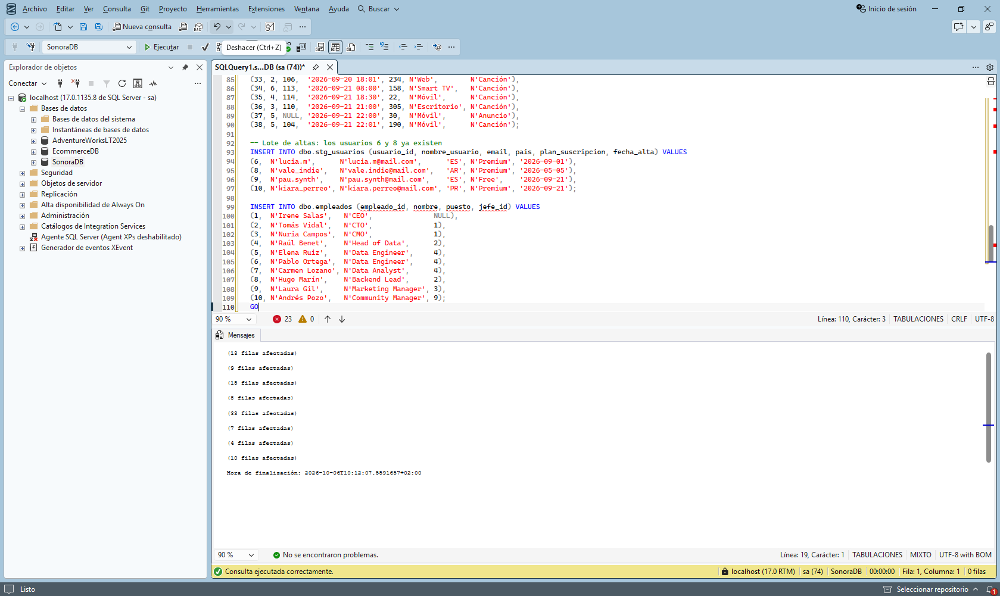

*Figura 4. Carga de datos: filas afectadas por cada INSERT.*


### 1.5 Verificación

Comprobé los recuentos con una consulta `UNION ALL` sobre las ocho tablas. Coinciden con las filas insertadas (Figura 5).

```sql
SELECT 'generos' AS tabla, COUNT(*) AS filas FROM dbo.generos
UNION ALL SELECT 'artistas', COUNT(*) FROM dbo.artistas
UNION ALL SELECT 'canciones', COUNT(*) FROM dbo.canciones
UNION ALL SELECT 'usuarios', COUNT(*) FROM dbo.usuarios
UNION ALL SELECT 'reproducciones', COUNT(*) FROM dbo.reproducciones
UNION ALL SELECT 'stg_reproducciones', COUNT(*) FROM dbo.stg_reproducciones
UNION ALL SELECT 'stg_usuarios', COUNT(*) FROM dbo.stg_usuarios
UNION ALL SELECT 'empleados', COUNT(*) FROM dbo.empleados;
```

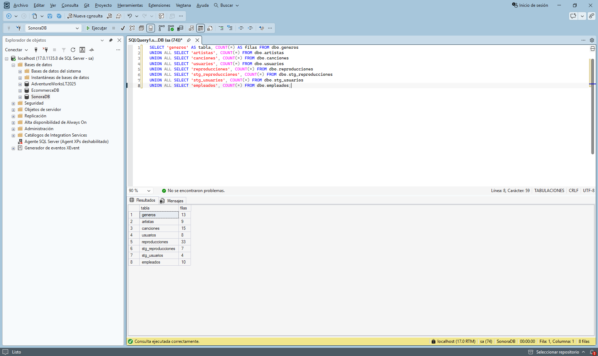

*Figura 5. Recuento de filas por tabla tras la carga.*


## 2. Ejemplos de subconsultas

Ejecuté los ocho ejemplos de la clase en el orden original, sobre SonoraDB con 33 reproducciones. El INSERT del ejemplo 8 es el único paso que modifica datos después de la carga inicial. La Tabla 2 resume cada ejemplo.

*Tabla 2. Resumen de los ejemplos ejecutados.*

| Ejemplo | Tipo | Resultado | Figuras |
|---|---|---|---|
| 1 | Escalar en WHERE | 5 canciones por encima de la media (232 s) | 6, 7 |
| 2 | Escalar en SELECT | Luna Roja: -47 y -31 s respecto a la media | 8 |
| 3 | De lista con IN, anidada | 3 usuarios | 9 |
| 4 | Tabla derivada en FROM | 3 usuarios con 5 o más canciones | 10 |
| 5 | Correlacionada | Última reproducción de 7 usuarios | 11 |
| 6 | EXISTS | 5 artistas con lanzamientos en 2026 | 12 |
| 7 | NOT IN frente a NOT EXISTS | 0 filas frente a 2 canciones | 13, 14 |
| 8 | NOT EXISTS en carga incremental | 5 filas nuevas insertadas | 15, 16 |


### 2.1 Ejemplo 1. Subconsulta escalar en WHERE

Pregunta de negocio: qué canciones del catálogo duran más que la media. Primero resolví la consulta interna por separado (Figura 6). Devuelve 232 porque `AVG` sobre una columna `int` devuelve un `int`; la media real es 232,2.

```sql
SELECT AVG(duracion_seg) FROM dbo.canciones;
```

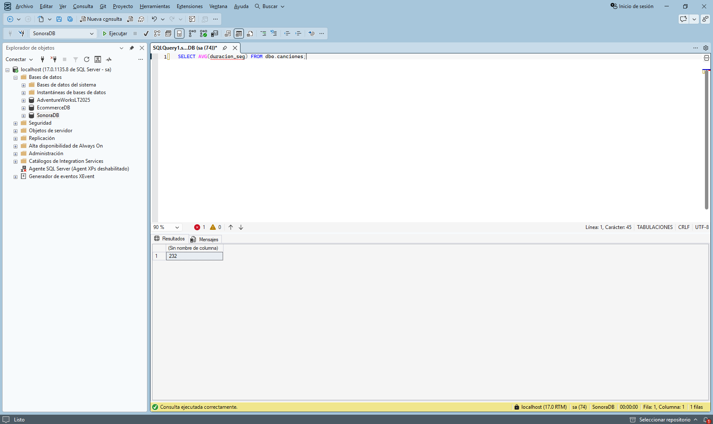

*Figura 6. Ejemplo 1, paso 1: media de duración del catálogo.*

Después usé esa consulta dentro del `WHERE` (Figura 7). Cinco canciones superan la media, desde Fábrica 4AM (412 s) hasta Corriente Alterna (234 s).

```sql
SELECT titulo, duracion_seg
FROM dbo.canciones
WHERE duracion_seg > (SELECT AVG(duracion_seg) FROM dbo.canciones)
ORDER BY duracion_seg DESC;
```

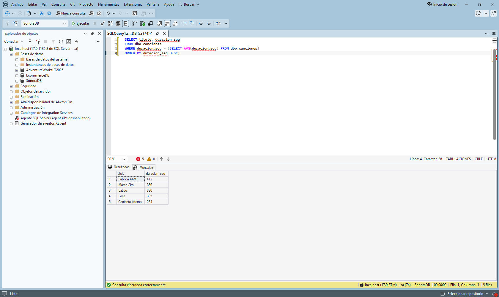

*Figura 7. Ejemplo 1, paso 2: canciones por encima de la media.*


### 2.2 Ejemplo 2. Subconsulta escalar en SELECT

Para las canciones de Luna Roja (artista 1) calculé cuánto se desvía su duración de la media del catálogo. La subconsulta escalar aparece dos veces: como columna `media_catalogo` y dentro de la resta que da `diferencia`. Verano en Bucle (185 s) queda 47 segundos por debajo de la media y Neón (201 s) queda 31 por debajo (Figura 8).

```sql
SELECT titulo,
       duracion_seg,
       (SELECT AVG(duracion_seg) FROM dbo.canciones) AS media_catalogo,
       duracion_seg - (SELECT AVG(duracion_seg) FROM dbo.canciones) AS diferencia
FROM dbo.canciones
WHERE artista_id = 1;
```

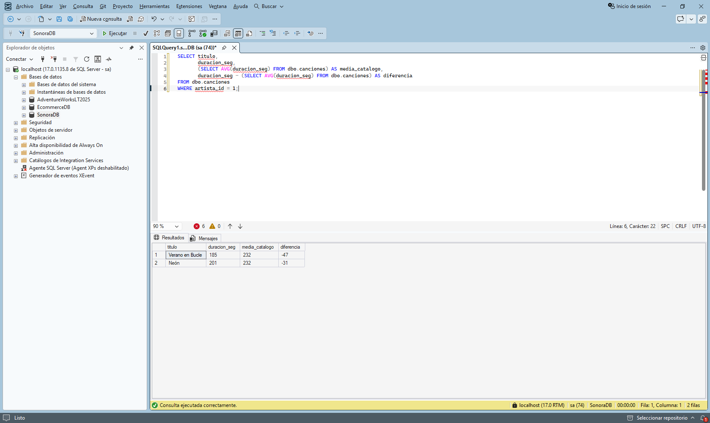

*Figura 8. Ejemplo 2: subconsulta escalar en la cláusula SELECT.*


### 2.3 Ejemplo 3. Subconsulta de lista con IN

Marketing quiere notificar a los usuarios que han escuchado alguna canción de Nébula. La consulta tiene tres niveles: el `artista_id` de Nébula, las canciones de ese artista y los usuarios que reprodujeron esas canciones. El resultado son alexbeats, lucia.m y sofi.trap (Figura 9). `IN` no duplica filas: sofi.trap escuchó dos canciones de Nébula, la 108 y la 109, y aparece una sola vez.

```sql
SELECT nombre_usuario, plan_suscripcion
FROM dbo.usuarios
WHERE usuario_id IN (
    SELECT usuario_id
    FROM dbo.reproducciones
    WHERE cancion_id IN (
        SELECT cancion_id
        FROM dbo.canciones
        WHERE artista_id = (SELECT artista_id FROM dbo.artistas WHERE nombre = N'Nébula')
    )
)
ORDER BY nombre_usuario;
```

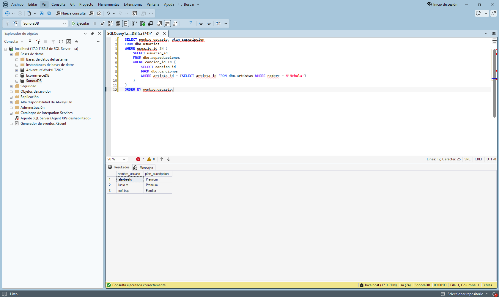

*Figura 9. Ejemplo 3: usuarios que han escuchado a Nébula con IN anidado.*


### 2.4 Ejemplo 4. Tabla derivada en FROM

Busqué los usuarios con cinco o más canciones reproducidas. La tabla derivada `t` cuenta las reproducciones de tipo Canción por usuario y la consulta externa la une con `usuarios` y filtra. Los anuncios no cuentan por el filtro sobre `tipo_contenido`. El resultado es alexbeats con 6, juanpi con 5 y sofi.trap con 5 (Figura 10).

```sql
SELECT u.nombre_usuario, u.plan_suscripcion, t.num_reproducciones
FROM (
    SELECT usuario_id, COUNT(*) AS num_reproducciones
    FROM dbo.reproducciones
    WHERE tipo_contenido = N'Canción'
    GROUP BY usuario_id
) AS t
JOIN dbo.usuarios AS u ON u.usuario_id = t.usuario_id
WHERE t.num_reproducciones >= 5
ORDER BY t.num_reproducciones DESC, u.nombre_usuario;
```

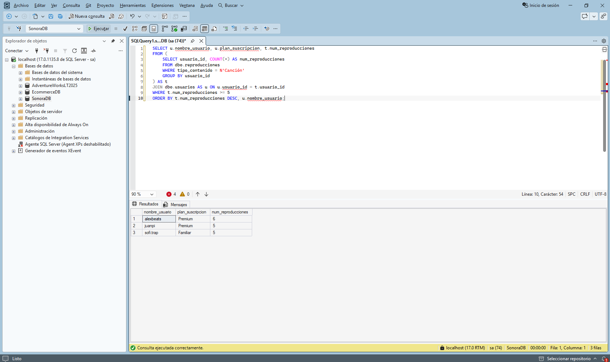

*Figura 10. Ejemplo 4: tabla derivada con el recuento de canciones por usuario.*


### 2.5 Ejemplo 5. Subconsulta correlacionada

Para cada usuario quería su última reproducción. La subconsulta calcula `MAX(fecha_hora)` de ese mismo usuario mediante `r2.usuario_id = r.usuario_id`, y la consulta externa conserva las filas cuya fecha coincide. El `LEFT JOIN` con `canciones` evita perder reproducciones sin canción. El resultado tiene 7 filas; vale_indie no aparece porque no tiene reproducciones (Figura 11).

```sql
SELECT u.nombre_usuario, r.fecha_hora, c.titulo
FROM dbo.reproducciones AS r
JOIN dbo.usuarios AS u ON u.usuario_id = r.usuario_id
LEFT JOIN dbo.canciones AS c ON c.cancion_id = r.cancion_id
WHERE r.fecha_hora = (
    SELECT MAX(r2.fecha_hora)
    FROM dbo.reproducciones AS r2
    WHERE r2.usuario_id = r.usuario_id
)
ORDER BY r.fecha_hora;
```

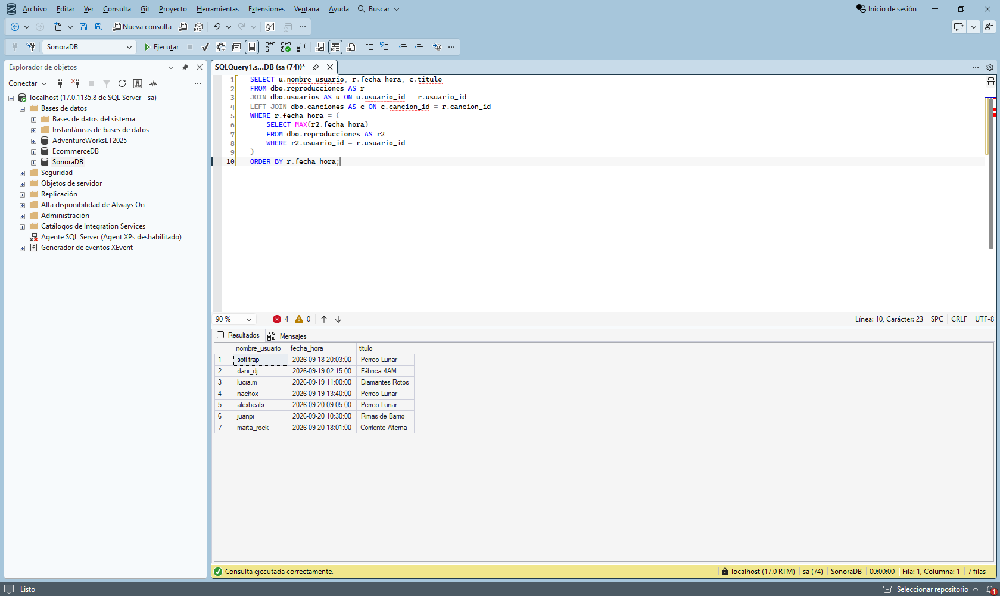

*Figura 11. Ejemplo 5: última reproducción de cada usuario con una subconsulta correlacionada.*


### 2.6 Ejemplo 6. EXISTS

Seleccioné los artistas que han publicado al menos una canción en 2026. `EXISTS` se detiene en la primera coincidencia y solo importa que exista alguna fila, por eso la subconsulta devuelve `SELECT 1`. Cumplen la condición DJ Coral, Los Voltios, Luna Roja, MC Brisa y Nébula (Figura 12).

```sql
SELECT a.nombre, a.pais
FROM dbo.artistas AS a
WHERE EXISTS (
    SELECT 1
    FROM dbo.canciones AS c
    WHERE c.artista_id = a.artista_id
      AND c.fecha_lanzamiento >= '2026-01-01'
)
ORDER BY a.nombre;
```

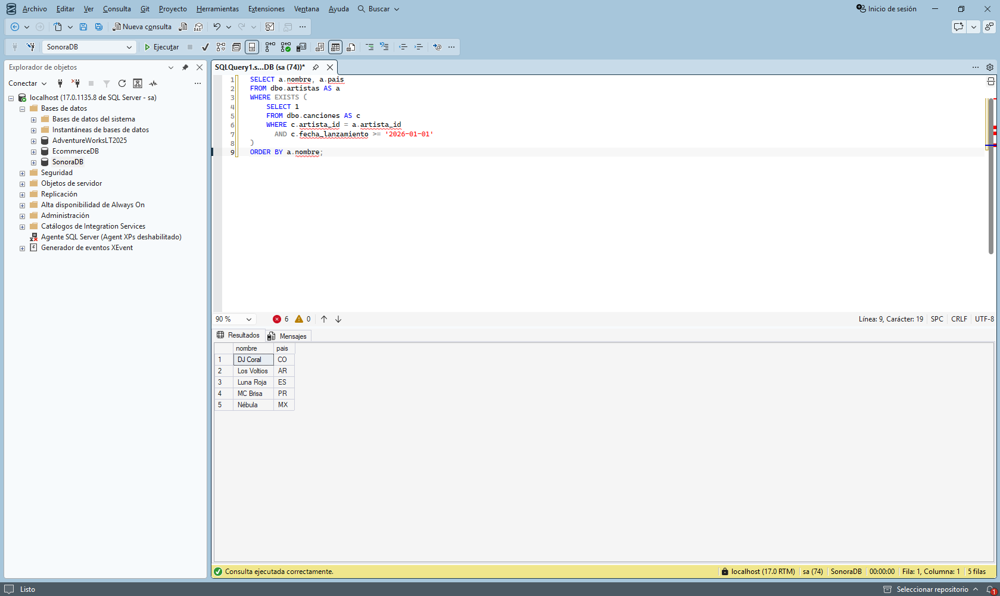

*Figura 12. Ejemplo 6: artistas con lanzamientos en 2026 mediante EXISTS.*


### 2.7 Ejemplo 7. NOT IN con valores NULL

Pregunta de negocio: qué canciones del catálogo no se han reproducido nunca. Con `NOT IN` el resultado es de cero filas, sin error ni aviso (Figura 13). La subconsulta devuelve también los `NULL` de las reproducciones de anuncios, cuyo `cancion_id` es nulo, y cualquier comparación con `NULL` da `UNKNOWN`, así que la condición nunca llega a ser verdadera. El editor indica que la columna admite nulos (`int, null`).

```sql
SELECT cancion_id, titulo
FROM dbo.canciones
WHERE cancion_id NOT IN (SELECT cancion_id FROM dbo.reproducciones);
```

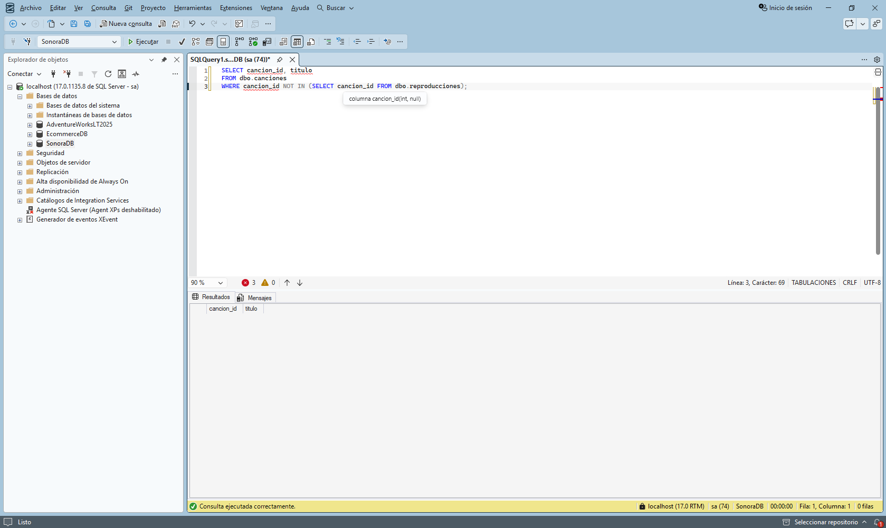

*Figura 13. Ejemplo 7: NOT IN devuelve 0 filas por los NULL de cancion_id.*

La versión con `NOT EXISTS` no se ve afectada por los nulos y devuelve las canciones 114, Sin Cobertura, y 115, Latido (Figura 14).

```sql
SELECT c.cancion_id, c.titulo
FROM dbo.canciones AS c
WHERE NOT EXISTS (
    SELECT 1
    FROM dbo.reproducciones AS r
    WHERE r.cancion_id = c.cancion_id
);
```

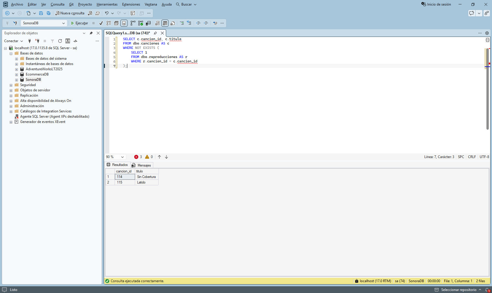

*Figura 14. Ejemplo 7: NOT EXISTS devuelve las canciones 114 y 115.*


### 2.8 Ejemplo 8. NOT EXISTS en una carga incremental

El lote del 21 de septiembre está en `stg_reproducciones` y contiene las filas 32 y 33, que ya estaban cargadas. La primera consulta identifica las filas del staging que aún no existen en destino: de la 34 a la 38 (Figura 15). La fila 37 tiene `cancion_id` nulo porque es un anuncio.

```sql
SELECT s.reproduccion_id, s.usuario_id, s.cancion_id, s.fecha_hora
FROM dbo.stg_reproducciones AS s
WHERE NOT EXISTS (
    SELECT 1
    FROM dbo.reproducciones AS r
    WHERE r.reproduccion_id = s.reproduccion_id
)
ORDER BY s.reproduccion_id;
```

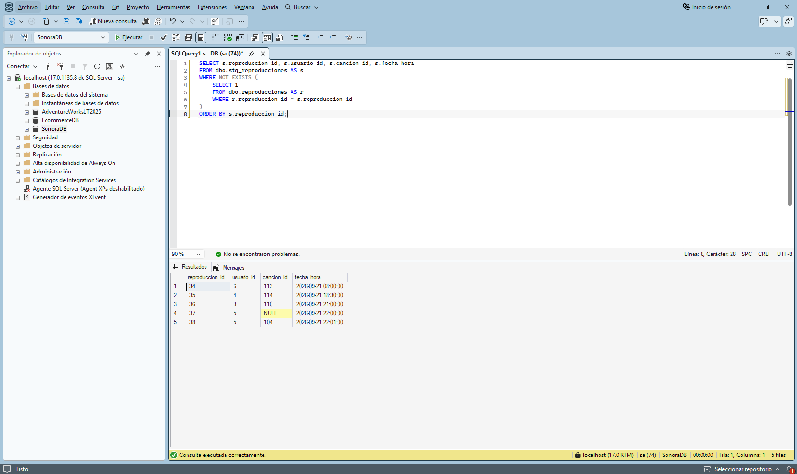

*Figura 15. Ejemplo 8, paso 1: filas del staging que no están en destino.*

Después convertí la consulta en un `INSERT ... SELECT` con la misma condición. La pestaña Mensajes muestra 5 filas afectadas (Figura 16), con lo que `reproducciones` pasa de 33 a 38 filas. Como la condición descarta las filas que ya existen en destino, repetir la carga no duplica datos.

```sql
INSERT INTO dbo.reproducciones
    (reproduccion_id, usuario_id, cancion_id, fecha_hora, segundos_escuchados, dispositivo, tipo_contenido)
SELECT s.reproduccion_id, s.usuario_id, s.cancion_id, s.fecha_hora,
       s.segundos_escuchados, s.dispositivo, s.tipo_contenido
FROM dbo.stg_reproducciones AS s
WHERE NOT EXISTS (
    SELECT 1
    FROM dbo.reproducciones AS r
    WHERE r.reproduccion_id = s.reproduccion_id
);
```

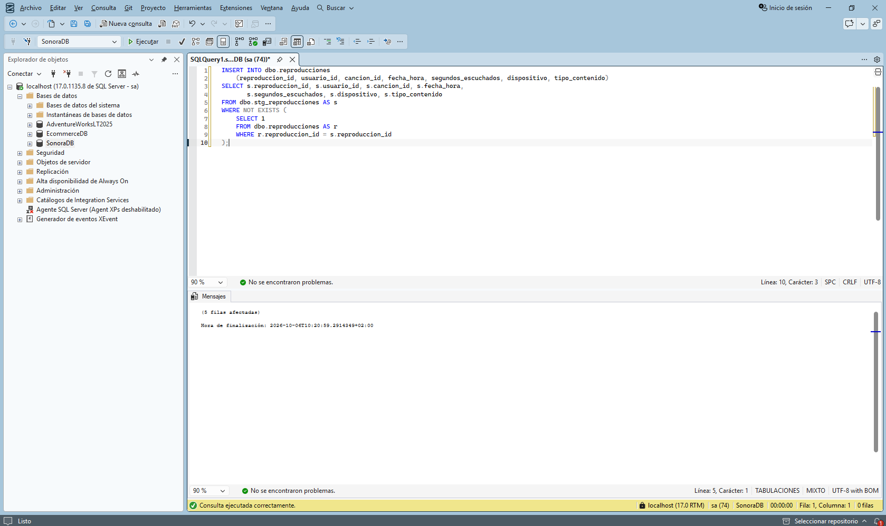

*Figura 16. Ejemplo 8, paso 2: INSERT con 5 filas afectadas.*


## 3. Puntos a tener en cuenta

`AVG` sobre una columna `int` devuelve un `int`. La media del catálogo es 232,2 s, pero la consulta devuelve 232, y las diferencias del ejemplo 2 salen como -47 y -31 en lugar de -47,2 y -31,2. Con `AVG(duracion_seg * 1.0)` se conservan los decimales.

`NOT IN` con una subconsulta que devuelve `NULL` no produce error: devuelve cero filas. En esta base ocurre porque los anuncios tienen `cancion_id` nulo. `NOT EXISTS` no se ve afectado; con `NOT IN` habría que añadir `WHERE cancion_id IS NOT NULL` dentro de la subconsulta.

Una subconsulta escalar que devuelve más de una fila provoca el error 512. `ORDER BY` dentro de una subconsulta solo se admite junto con `TOP` u `OFFSET` (error 1033). Una tabla derivada necesita siempre alias.

La subconsulta correlacionada del ejemplo 5 se evalúa conceptualmente una vez por cada fila externa. El optimizador suele reescribirla, pero en tablas grandes conviene revisar el plan de ejecución, que se verá en la sesión 13.

Tras el ejemplo 8, `reproducciones` tiene 38 filas, y los ejemplos y ejercicios posteriores de la serie asumen esa carga.


## 4. Scripts SQL incluidos

La carpeta `sql/` contiene un script por cada paso, numerados en el orden de ejecución. Todos, salvo el 01 y el 02, empiezan con `USE SonoraDB`. La Tabla 3 indica la figura que corresponde a cada uno.

*Tabla 3. Scripts de la carpeta sql/.*

| Script | Contenido | Figura |
|---|---|---|
| 01_version.sql | Versión del motor | 1 |
| 02_crear_bd.sql | Creación de SonoraDB y nivel 170 | 2 |
| 03_tablas.sql | Creación de las tablas | 3 |
| 04_datos.sql | Carga de datos | 4 |
| 05_verificar.sql | Recuento por tabla | 5 |
| 06_ej1_media.sql | Ejemplo 1, media del catálogo | 6 |
| 07_ej1_where.sql | Ejemplo 1, subconsulta en WHERE | 7 |
| 08_ej1_truncamiento.sql | Ejemplo 1, AVG con y sin decimales | - |
| 09_ej2_select.sql | Ejemplo 2, subconsulta en SELECT | 8 |
| 10_ej3_in.sql | Ejemplo 3, IN anidado | 9 |
| 11_ej4_derivada.sql | Ejemplo 4, tabla derivada | 10 |
| 12_ej5_correlacionada.sql | Ejemplo 5, subconsulta correlacionada | 11 |
| 13_ej6_exists.sql | Ejemplo 6, EXISTS | 12 |
| 14_ej7_not_in.sql | Ejemplo 7, NOT IN con NULL | 13 |
| 15_ej7_not_exists.sql | Ejemplo 7, NOT EXISTS | 14 |
| 16_ej8_paso1_nuevas.sql | Ejemplo 8, filas nuevas del staging | 15 |
| 17_ej8_paso2_insert.sql | Ejemplo 8, carga incremental | 16 |
| 18_ej8_conteo.sql | Ejemplo 8, recuento final | - |
