# Expresiones de tabla comunes (CTE). SalesDB y SonoraDB

CTE no recursivas y recursivas, con su equivalente mediante subconsultas, sobre SQL Server 2025.

- Autor: Álvaro García-Quismondo Lizana
- Programa: Máster en IA y Big Data, Tajamar
- Entorno: SQL Server 2025 (17.0), SSMS 22
- Bases de datos: SalesDB y SonoraDB
- Fecha: 7 de octubre de 2026

Estructura de la carpeta:

```text
.
├── README.md
├── CTE_SalesDB_SonoraDB.pdf
├── img/    capturas numeradas por figura
└── sql/
    ├── salesdb/   scripts de la primera parte
    └── sonora/    scripts de la segunda parte
```


## 1. Planteamiento

La práctica tiene dos partes. En la primera ejecuté el script de CTE de clase sobre SalesDB, la serie recursiva del 1 al 20 y la jerarquía de empleados, y añadí un ejemplo propio de CTE recursiva. En la segunda ejecuté los ejemplos 9 a 14 sobre SonoraDB, con su equivalente mediante subconsultas, y resolví los doce ejercicios de refuerzo. Todo se ejecutó en SQL Server 2025 (17.0) desde SSMS 22.

No tenía instalada la base SalesDB de clase, así que la recreé con `sql/salesdb/00_crear_salesdb.sql`: esquema `Sales` con las tablas `Customers`, `Orders` y `Employees` y los datos que usa el script. SonoraDB es la de la sesión anterior, con 38 reproducciones tras la carga del ejemplo 8 de aquella sesión.

Una CTE es un resultado con nombre que vive solo durante la consulta que la sigue. Se escribe `WITH nombre AS (consulta)` y después se usa como si fuera una tabla. Las CTE encadenadas se separan por comas, y una CTE recursiva se compone de una parte ancla, `UNION ALL` y una parte recursiva que se refiere a la propia CTE.


## 2. SalesDB: ejemplos de clase


### 2.1 Comprobación de la base

Antes de ejecutar nada comprobé que la base activa era SalesDB y que las tres tablas tenían filas: 5 clientes, 10 pedidos y 5 empleados (Figura 1).

```sql
SELECT DB_NAME() AS base_de_datos;

SELECT 'Sales.Customers' AS tabla, COUNT(*) AS filas FROM Sales.Customers
UNION ALL SELECT 'Sales.Orders',    COUNT(*) FROM Sales.Orders
UNION ALL SELECT 'Sales.Employees', COUNT(*) FROM Sales.Employees;
```

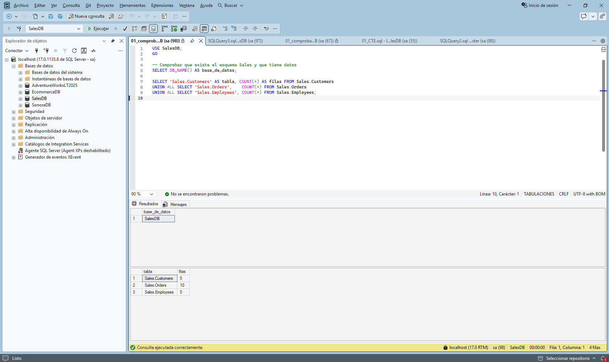

*Figura 1. Comprobación de SalesDB: base activa y filas de Customers, Orders y Employees.*


### 2.2 CTE no recursiva

El script de clase encadena cuatro CTE. `CTE_Total_Sales` suma las ventas por cliente, `CTE_Last_Order` obtiene la fecha del último pedido, `CTE_Customer_Rank` ordena a los clientes por ventas con `RANK()` y `CTE_Customer_Segments` los clasifica en High, Medium o Low. La consulta principal une todas con `Sales.Customers`. Jossef Goldberg suma 110 y queda segundo, Mary 125 y es primera, Kevin Brown 55 es Low y Mark Schwarz 90 es Medium. Anna Adams no tiene pedidos y por eso sus columnas salen a NULL (Figura 2).

El script original no se podía ejecutar tal cual: el comentario de cabecera estaba sin cerrar y faltaba un `;` antes del segundo `WITH`. Lo corregí en `02_cte_no_recursiva.sql`.

```sql
WITH CTE_Total_Sales AS
(
    SELECT CustomerID, SUM(Sales) AS TotalSales
    FROM Sales.Orders
    GROUP BY CustomerID
)
, CTE_Last_Order AS
(
    SELECT CustomerID, MAX(OrderDate) AS Last_Order
    FROM Sales.Orders
    GROUP BY CustomerID
)
, CTE_Customer_Rank AS
(
    SELECT CustomerID, TotalSales,
           RANK() OVER (ORDER BY TotalSales DESC) AS CustomerRank
    FROM CTE_Total_Sales
)
, CTE_Customer_Segments AS
(
    SELECT CustomerID, TotalSales,
           CASE
               WHEN TotalSales > 100 THEN 'High'
               WHEN TotalSales > 80  THEN 'Medium'
               ELSE 'Low'
           END AS CustomerSegments
    FROM CTE_Total_Sales
)
SELECT
    c.CustomerID, c.FirstName, c.LastName,
    cts.TotalSales, clo.Last_Order, ccr.CustomerRank, ccs.CustomerSegments
FROM Sales.Customers AS c
LEFT JOIN CTE_Total_Sales       AS cts ON cts.CustomerID = c.CustomerID
LEFT JOIN CTE_Last_Order        AS clo ON clo.CustomerID = c.CustomerID
LEFT JOIN CTE_Customer_Rank     AS ccr ON ccr.CustomerID = c.CustomerID
LEFT JOIN CTE_Customer_Segments AS ccs ON ccs.CustomerID = c.CustomerID;
```

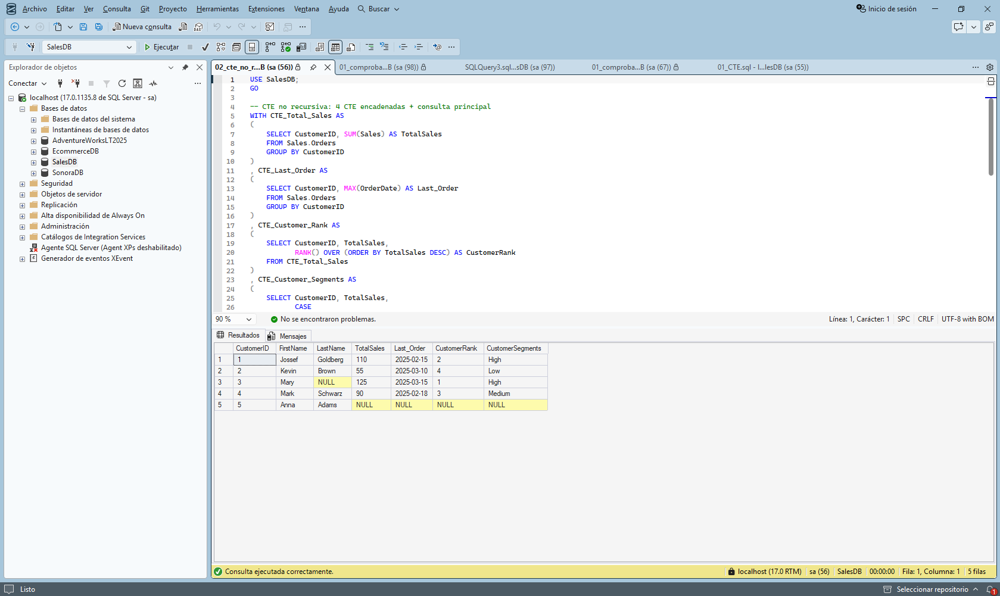

*Figura 2. Cuatro CTE encadenadas y consulta principal.*


### 2.3 CTE recursiva: serie del 1 al 20

La parte ancla devuelve el número 1. La parte recursiva suma 1 al último número obtenido y se repite mientras `MyNumber < 20`. Cuando la parte recursiva no devuelve ninguna fila, la recursión se detiene. El resultado son 20 filas (Figura 3). La Tabla 1 detalla las primeras vueltas.

*Tabla 1. Primeras vueltas de la serie recursiva.*

| Vuelta | Parte que se ejecuta | Filas nuevas | Acumulado |
|---|---|---|---|
| 0 | Ancla | 1 | 1 |
| 1 | Recursiva sobre la fila 1 | 2 | 1, 2 |
| 2 | Recursiva sobre la fila 2 | 3 | 1, 2, 3 |
| ... | ... | ... | ... |
| 19 | Recursiva sobre la fila 19 | 20 | 1 a 20 |
| 20 | Recursiva sobre la fila 20: 20 < 20 es falso | ninguna | Fin |

```sql
WITH Series AS
(
    SELECT 1 AS MyNumber          -- ancla
    UNION ALL
    SELECT MyNumber + 1           -- recursivo
    FROM Series
    WHERE MyNumber < 20
)
SELECT * FROM Series;
```

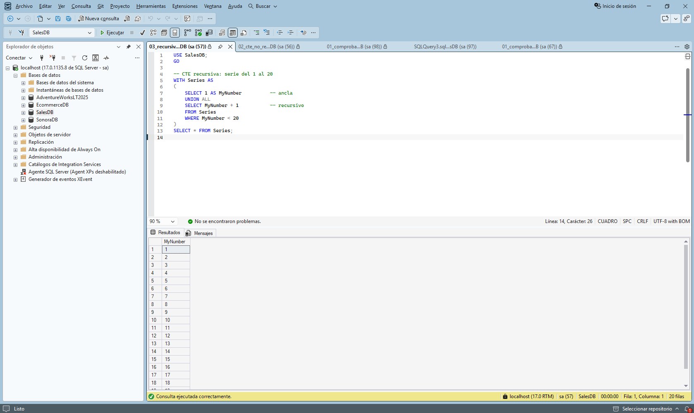

*Figura 3. CTE recursiva: serie del 1 al 20.*


### 2.4 Límite de recursión

Con la misma serie hasta 1000 el motor se detiene en la vuelta 100 y devuelve el error 530, porque `MAXRECURSION` vale 100 por defecto (Figura 4). Lo ejecuté a propósito para ver el mensaje. Con `OPTION (MAXRECURSION 5000)` la consulta termina y devuelve 1000 filas (Figura 5).

```sql
WITH Series AS
(
    SELECT 1 AS MyNumber
    UNION ALL
    SELECT MyNumber + 1
    FROM Series
    WHERE MyNumber < 1000
)
SELECT * FROM Series;
```

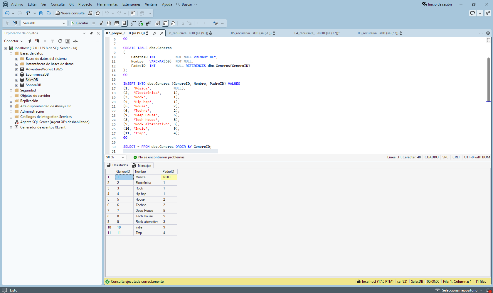

*Figura 4. Error 530 al superar las 100 recursiones por defecto.*

```sql
WITH Series AS
(
    SELECT 1 AS MyNumber
    UNION ALL
    SELECT MyNumber + 1
    FROM Series
    WHERE MyNumber < 1000
)
SELECT * FROM Series
OPTION (MAXRECURSION 5000);
```

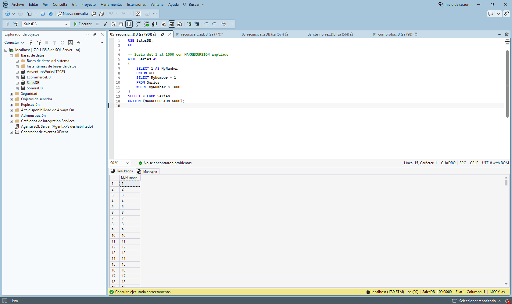

*Figura 5. Serie del 1 al 1000 con MAXRECURSION ampliado.*


### 2.5 Jerarquía de empleados

Este es el último ejercicio del script. El ancla toma al empleado sin jefe (`ManagerID IS NULL`), Frank, con nivel 1. La parte recursiva une `Sales.Employees` con la propia CTE, empleado contra jefe, y suma 1 al nivel. Kevin y Mary dependen de Frank y salen con nivel 2. Carol depende de Mary y Michael de Kevin, ambos con nivel 3 (Figura 6). La Tabla 2 muestra qué fila añade cada vuelta.

*Tabla 2. Vueltas de la jerarquía de empleados.*

| Vuelta | Se unen los empleados cuyo jefe es | Filas nuevas | Nivel |
|---|---|---|---|
| 0 | Ancla: sin jefe | Frank | 1 |
| 1 | Frank | Kevin, Mary | 2 |
| 2 | Kevin y Mary | Michael, Carol | 3 |
| 3 | Michael y Carol | ninguna | Fin |

```sql
WITH CTE_Emp_Hierarchy AS
(
    SELECT EmployeeID, FirstName, ManagerID, 1 AS Level   -- ancla: sin jefe
    FROM Sales.Employees
    WHERE ManagerID IS NULL
    UNION ALL
    SELECT e.EmployeeID, e.FirstName, e.ManagerID, ceh.Level + 1
    FROM Sales.Employees AS e
    INNER JOIN CTE_Emp_Hierarchy AS ceh
        ON e.ManagerID = ceh.EmployeeID
)
SELECT * FROM CTE_Emp_Hierarchy;
```

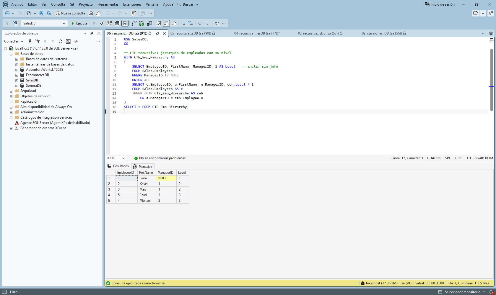

*Figura 6. Jerarquía de empleados con su nivel.*


## 3. SalesDB: ejemplo propio de CTE recursiva

Elegí un árbol de géneros musicales, que es una jerarquía como la de empleados pero con otros datos. La tabla `dbo.Generos` tiene una clave `GeneroID` y una columna `PadreID` que apunta a esa misma clave. Hay 11 géneros: Música es la raíz, Electrónica, Rock, Hip hop cuelgan de ella, House y Techno cuelgan de Electrónica, y así hasta cuatro niveles (Figura 7).

```sql
IF OBJECT_ID('dbo.Generos', 'U') IS NOT NULL DROP TABLE dbo.Generos;
GO

CREATE TABLE dbo.Generos
(
    GeneroID INT          NOT NULL PRIMARY KEY,
    Nombre   VARCHAR(50)  NOT NULL,
    PadreID  INT          NULL REFERENCES dbo.Generos(GeneroID)
);
GO

INSERT INTO dbo.Generos (GeneroID, Nombre, PadreID) VALUES
(1,  'Música',           NULL),
(2,  'Electrónica',      1),
(3,  'Rock',             1),
(4,  'Hip hop',          1),
(5,  'House',            2),
(6,  'Techno',           2),
(7,  'Deep House',       5),
(8,  'Tech House',       5),
(9,  'Rock alternativo', 3),
(10, 'Indie',            9),
(11, 'Trap',             4);
GO

SELECT * FROM dbo.Generos ORDER BY GeneroID;
```

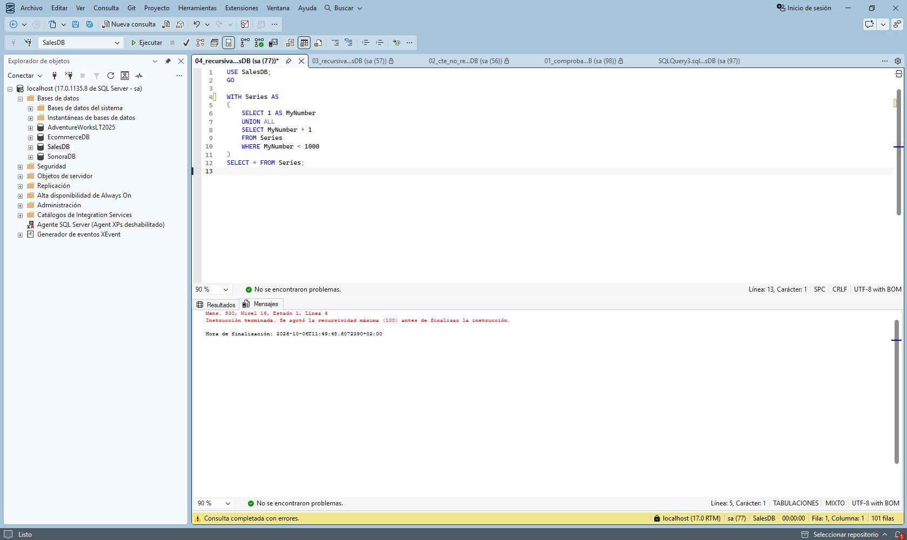

*Figura 7. Ejemplo propio: tabla Generos con 11 filas.*

La primera consulta recorre el árbol completo desde la raíz. Además del nivel calcula la ruta concatenando los nombres. La columna `Ruta` se convierte con `CAST(... AS VARCHAR(200))` en el ancla; sin esa conversión el motor da el error 240 porque el tipo del ancla y el de la parte recursiva no coinciden. El resultado tiene 11 filas, ordenadas por ruta, con sangría según el nivel (Figura 8).

```sql
WITH Arbol AS
(
    -- Ancla: el género raíz (sin padre)
    SELECT GeneroID, Nombre, PadreID,
           1 AS Nivel,
           CAST(Nombre AS VARCHAR(200)) AS Ruta
    FROM dbo.Generos
    WHERE PadreID IS NULL

    UNION ALL

    -- Recursivo: hijos de los géneros ya obtenidos
    SELECT g.GeneroID, g.Nombre, g.PadreID,
           a.Nivel + 1,
           CAST(a.Ruta + ' > ' + g.Nombre AS VARCHAR(200))
    FROM dbo.Generos AS g
    INNER JOIN Arbol AS a ON g.PadreID = a.GeneroID
)
SELECT GeneroID,
       REPLICATE('    ', Nivel - 1) + Nombre AS Genero,
       Nivel,
       Ruta
FROM Arbol
ORDER BY Ruta;
```

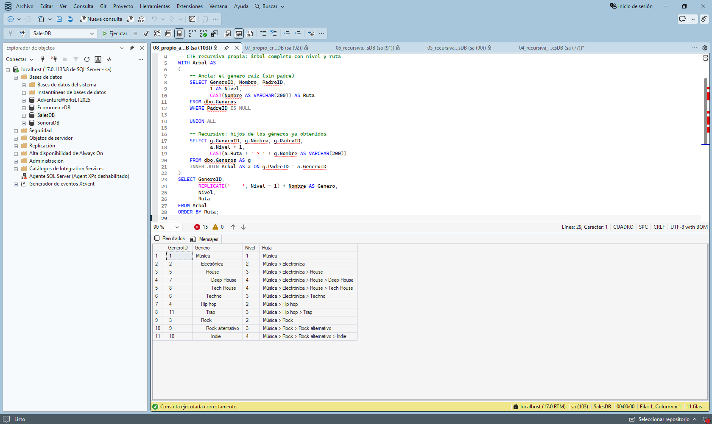

*Figura 8. Ejemplo propio: árbol completo con nivel y ruta.*

La segunda consulta usa el mismo patrón, pero el ancla es un género concreto, Electrónica, en vez de la raíz. Devuelve el subárbol de ese género, 5 filas: Electrónica, House, Techno, Deep House y Tech House (Figura 9).

```sql
WITH Subarbol AS
(
    SELECT GeneroID, Nombre, PadreID, 1 AS Nivel
    FROM dbo.Generos
    WHERE Nombre = 'Electrónica'          -- ancla: nodo elegido

    UNION ALL

    SELECT g.GeneroID, g.Nombre, g.PadreID, s.Nivel + 1
    FROM dbo.Generos AS g
    INNER JOIN Subarbol AS s ON g.PadreID = s.GeneroID
)
SELECT GeneroID, Nombre, Nivel
FROM Subarbol
ORDER BY Nivel, Nombre;
```

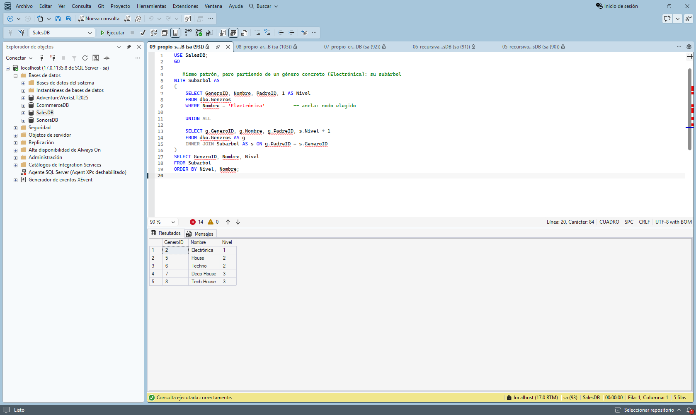

*Figura 9. Ejemplo propio: subárbol de Electrónica.*


## 4. SonoraDB: ejemplos 9 a 14 y su equivalente con subconsultas

Para cada ejemplo con CTE ejecuté también una versión sin CTE. Las CTE simples, encadenadas o reutilizadas se reescriben con tablas derivadas. La CTE recursiva no tiene un equivalente general con subconsultas, porque una subconsulta no puede referirse a sí misma. Las alternativas de los ejemplos 11, 12 y 13 solo funcionan porque la profundidad del árbol es conocida, y dejarían de valer si se añadiera un nivel más.


### 4.1 Ejemplo 9. CTE simple

Obtiene las tres canciones con más reproducciones válidas, es decir, de tipo Canción y con al menos 30 segundos. La CTE `validas` filtra y la consulta principal cuenta por título. Salen Perreo Lunar con 6, Corriente Alterna con 3 y Galaxia Dembow con 3 (Figura 10). La versión con tabla derivada devuelve lo mismo (Figura 11).

```sql
WITH validas AS (
    SELECT cancion_id
    FROM dbo.reproducciones
    WHERE tipo_contenido = N'Canción'
      AND segundos_escuchados >= 30
)
SELECT TOP (3) c.titulo, COUNT(*) AS reproducciones_validas
FROM validas AS v
JOIN dbo.canciones AS c ON c.cancion_id = v.cancion_id
GROUP BY c.titulo
ORDER BY reproducciones_validas DESC, c.titulo;
```

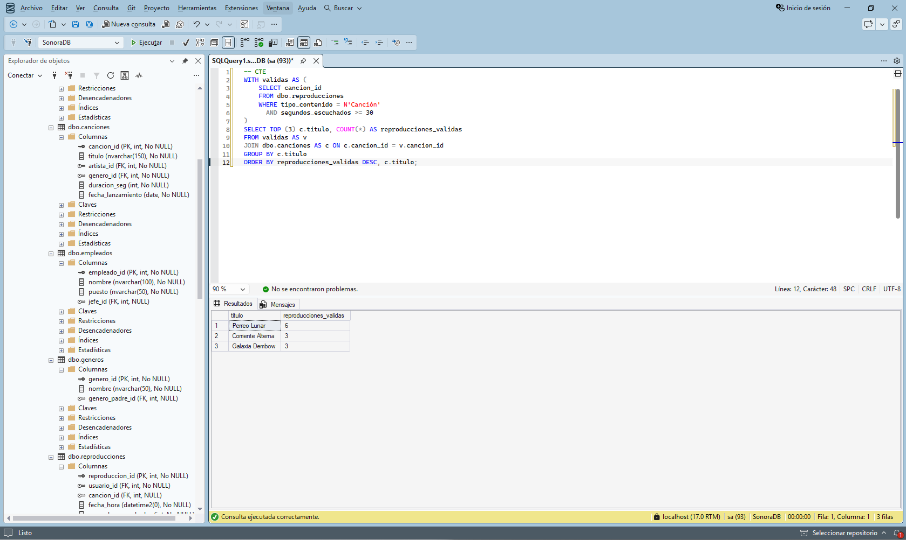

*Figura 10. Ejemplo 9 con CTE.*

```sql
SELECT TOP (3) c.titulo, COUNT(*) AS reproducciones_validas
FROM (SELECT cancion_id
      FROM dbo.reproducciones
      WHERE tipo_contenido = N'Canción'
        AND segundos_escuchados >= 30) AS v
JOIN dbo.canciones AS c ON c.cancion_id = v.cancion_id
GROUP BY c.titulo
ORDER BY reproducciones_validas DESC, c.titulo;
```

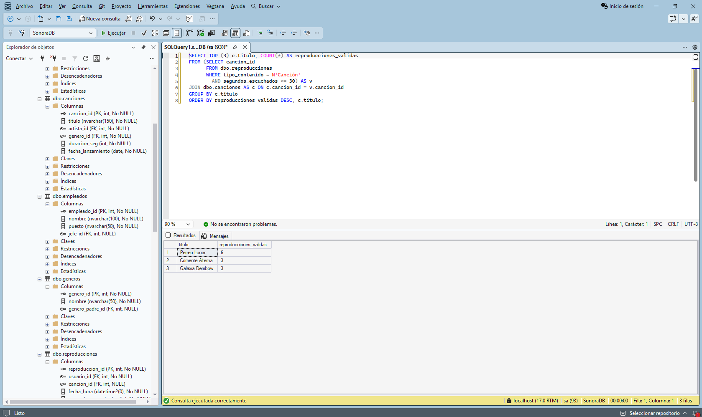

*Figura 11. Ejemplo 9 con tabla derivada.*


### 4.2 Ejemplo 10. CTE encadenadas

Tres CTE en pipeline: la primera filtra las reproducciones válidas, la segunda las une con canciones y géneros y la tercera agrega por género. El resultado son 9 géneros, desde Reguetón con 23,9 minutos hasta Metal con 7,1 (Figura 12). Con tablas derivadas anidadas, cada nivel va dentro del `FROM` del siguiente, y el resultado es el mismo (Figura 13).

```sql
WITH limpias AS (
    SELECT cancion_id, segundos_escuchados
    FROM dbo.reproducciones
    WHERE tipo_contenido = N'Canción'
      AND segundos_escuchados >= 30
),
enriquecidas AS (
    SELECT l.segundos_escuchados, g.nombre AS genero
    FROM limpias AS l
    JOIN dbo.canciones AS c ON c.cancion_id = l.cancion_id
    JOIN dbo.generos   AS g ON g.genero_id  = c.genero_id
),
agregadas AS (
    SELECT genero,
           COUNT(*) AS reproducciones,
           CAST(SUM(segundos_escuchados) / 60.0 AS decimal(6,1)) AS minutos
    FROM enriquecidas
    GROUP BY genero
)
SELECT genero, reproducciones, minutos
FROM agregadas
ORDER BY minutos DESC, genero;
```

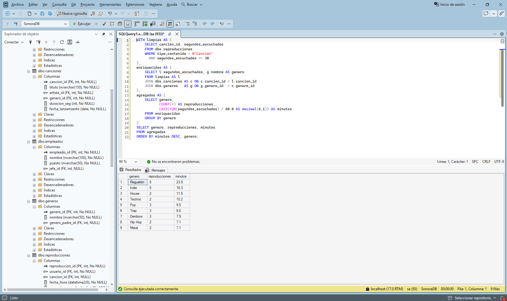

*Figura 12. Ejemplo 10 con tres CTE encadenadas.*

```sql
SELECT genero, reproducciones, minutos
FROM (SELECT genero,
             COUNT(*) AS reproducciones,
             CAST(SUM(segundos_escuchados) / 60.0 AS decimal(6,1)) AS minutos
      FROM (SELECT l.segundos_escuchados, g.nombre AS genero
            FROM (SELECT cancion_id, segundos_escuchados
                  FROM dbo.reproducciones
                  WHERE tipo_contenido = N'Canción'
                    AND segundos_escuchados >= 30) AS l
            JOIN dbo.canciones AS c ON c.cancion_id = l.cancion_id
            JOIN dbo.generos   AS g ON g.genero_id  = c.genero_id) AS enriquecidas
      GROUP BY genero) AS agregadas
ORDER BY minutos DESC, genero;
```

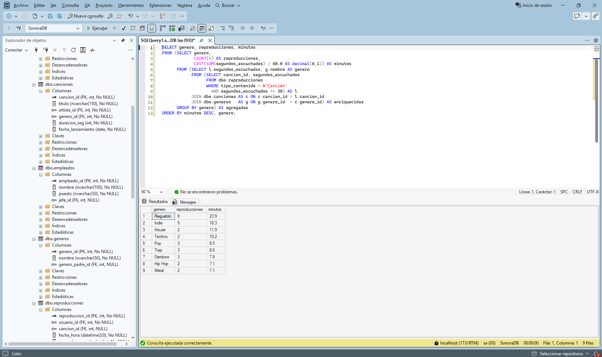

*Figura 13. Ejemplo 10 con tablas derivadas anidadas.*


### 4.3 Ejemplo 11. CTE recursiva: árbol de géneros

Recorre los géneros desde la raíz con su nivel y su ruta. Devuelve 13 filas (Figura 14). La alternativa une `generos` consigo misma una vez por nivel y reúne los resultados con `UNION ALL`. Da las mismas 13 filas (Figura 15), pero tiene que conocer de antemano que el árbol tiene cuatro niveles.

```sql
WITH arbol AS (
    SELECT genero_id, nombre, genero_padre_id,
           0 AS nivel,
           CAST(nombre AS nvarchar(200)) AS ruta
    FROM dbo.generos
    WHERE genero_padre_id IS NULL

    UNION ALL

    SELECT g.genero_id, g.nombre, g.genero_padre_id,
           a.nivel + 1,
           CAST(a.ruta + N' > ' + g.nombre AS nvarchar(200))
    FROM dbo.generos AS g
    JOIN arbol AS a ON g.genero_padre_id = a.genero_id
)
SELECT genero_id, nombre, nivel, ruta
FROM arbol
ORDER BY ruta;
```

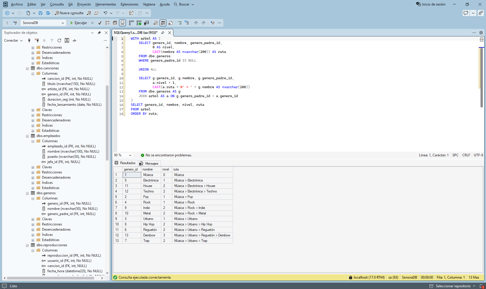

*Figura 14. Ejemplo 11 con CTE recursiva.*

```sql
SELECT genero_id, nombre, nivel, ruta
FROM (
    SELECT g0.genero_id, g0.nombre, 0 AS nivel,
           CAST(g0.nombre AS nvarchar(200)) AS ruta
    FROM dbo.generos AS g0
    WHERE g0.genero_padre_id IS NULL

    UNION ALL
    SELECT g1.genero_id, g1.nombre, 1,
           CAST(g0.nombre + N' > ' + g1.nombre AS nvarchar(200))
    FROM dbo.generos AS g1
    JOIN dbo.generos AS g0 ON g1.genero_padre_id = g0.genero_id
    WHERE g0.genero_padre_id IS NULL

    UNION ALL
    SELECT g2.genero_id, g2.nombre, 2,
           CAST(g0.nombre + N' > ' + g1.nombre + N' > ' + g2.nombre AS nvarchar(200))
    FROM dbo.generos AS g2
    JOIN dbo.generos AS g1 ON g2.genero_padre_id = g1.genero_id
    JOIN dbo.generos AS g0 ON g1.genero_padre_id = g0.genero_id
    WHERE g0.genero_padre_id IS NULL

    UNION ALL
    SELECT g3.genero_id, g3.nombre, 3,
           CAST(g0.nombre + N' > ' + g1.nombre + N' > ' + g2.nombre + N' > ' + g3.nombre AS nvarchar(200))
    FROM dbo.generos AS g3
    JOIN dbo.generos AS g2 ON g3.genero_padre_id = g2.genero_id
    JOIN dbo.generos AS g1 ON g2.genero_padre_id = g1.genero_id
    JOIN dbo.generos AS g0 ON g1.genero_padre_id = g0.genero_id
    WHERE g0.genero_padre_id IS NULL
) AS arbol
ORDER BY ruta;
```

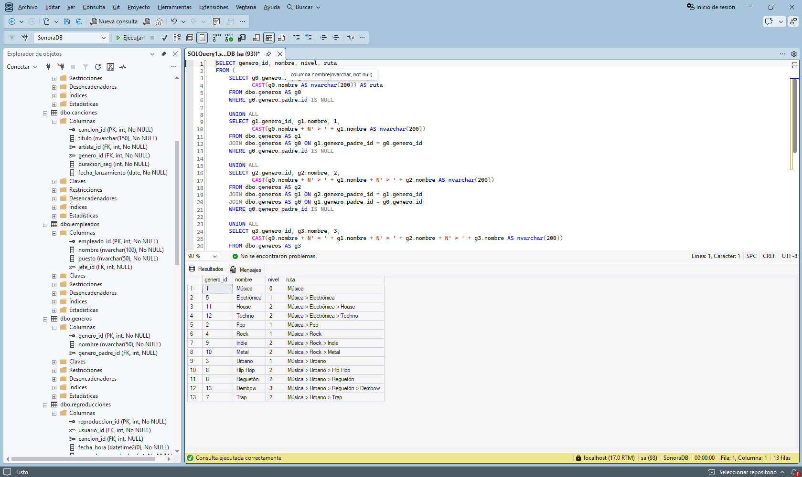

*Figura 15. Ejemplo 11 con autouniones de profundidad fija.*


### 4.4 Ejemplo 12. CTE recursiva con agregación

Cuenta las reproducciones válidas de cada género principal incluyendo todos sus subgéneros. La CTE recursiva asocia cada género con su raíz y después se cuentan las reproducciones: Urbano 16, Rock 7, Electrónica 4 y Pop 3 (Figura 16). La alternativa anida `IN` para cubrir hijos y nietos y devuelve las mismas cifras (Figura 17).

```sql
WITH arbol AS (
    SELECT genero_id, genero_id AS raiz_id
    FROM dbo.generos
    WHERE genero_padre_id = (SELECT genero_id FROM dbo.generos WHERE genero_padre_id IS NULL)

    UNION ALL

    SELECT g.genero_id, a.raiz_id
    FROM dbo.generos AS g
    JOIN arbol AS a ON g.genero_padre_id = a.genero_id
)
SELECT gr.nombre AS genero_principal,
       COUNT(r.reproduccion_id) AS reproducciones_validas
FROM arbol AS a
JOIN dbo.generos AS gr ON gr.genero_id = a.raiz_id
LEFT JOIN dbo.canciones AS c ON c.genero_id = a.genero_id
LEFT JOIN dbo.reproducciones AS r
       ON r.cancion_id = c.cancion_id
      AND r.tipo_contenido = N'Canción'
      AND r.segundos_escuchados >= 30
GROUP BY gr.nombre
ORDER BY reproducciones_validas DESC;
```

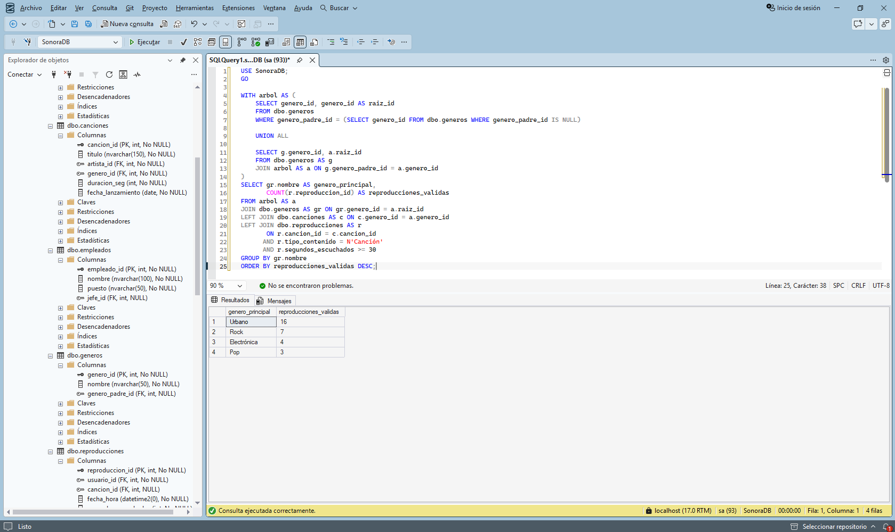

*Figura 16. Ejemplo 12 con CTE recursiva y agregación.*

```sql
SELECT gr.nombre AS genero_principal,
       (SELECT COUNT(*)
        FROM dbo.reproducciones AS r
        JOIN dbo.canciones AS c ON c.cancion_id = r.cancion_id
        WHERE r.tipo_contenido = N'Canción'
          AND r.segundos_escuchados >= 30
          AND c.genero_id IN (
                SELECT gr.genero_id                                   -- el propio género
                UNION
                SELECT g1.genero_id FROM dbo.generos AS g1            -- hijos
                WHERE g1.genero_padre_id = gr.genero_id
                UNION
                SELECT g2.genero_id FROM dbo.generos AS g2            -- nietos
                WHERE g2.genero_padre_id IN (SELECT g1.genero_id FROM dbo.generos AS g1
                                             WHERE g1.genero_padre_id = gr.genero_id)
          )) AS reproducciones_validas
FROM dbo.generos AS gr
WHERE gr.genero_padre_id = (SELECT genero_id FROM dbo.generos WHERE genero_padre_id IS NULL)
ORDER BY reproducciones_validas DESC;
```

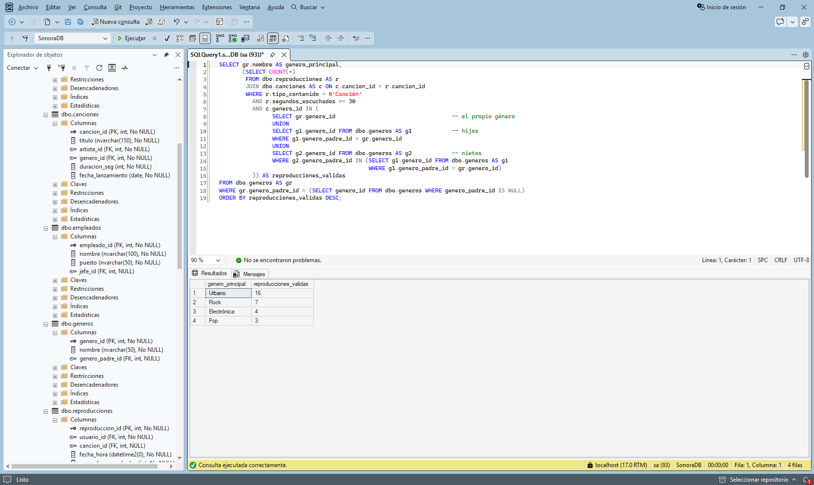

*Figura 17. Ejemplo 12 con IN anidados.*


### 4.5 Ejemplo 13. CTE recursiva para generar fechas

La CTE genera los días del 14 al 22 de septiembre y se hace un `LEFT JOIN` con las reproducciones para contar cuántas hubo cada día. El `LEFT JOIN` conserva el 22 de septiembre, que no tiene reproducciones y sale con 0 (Figura 18). Se añade `OPTION (MAXRECURSION 400)` por precaución. La alternativa construye los días sumando los números de una lista `VALUES` a la fecha inicial (Figura 19).

```sql
WITH dias AS (
    SELECT CAST('2026-09-14' AS date) AS dia
    UNION ALL
    SELECT DATEADD(DAY, 1, dia)
    FROM dias
    WHERE dia < '2026-09-22'
)
SELECT d.dia, COUNT(r.reproduccion_id) AS reproducciones
FROM dias AS d
LEFT JOIN dbo.reproducciones AS r
       ON CAST(r.fecha_hora AS date) = d.dia
      AND r.tipo_contenido = N'Canción'
GROUP BY d.dia
ORDER BY d.dia
OPTION (MAXRECURSION 400);
```

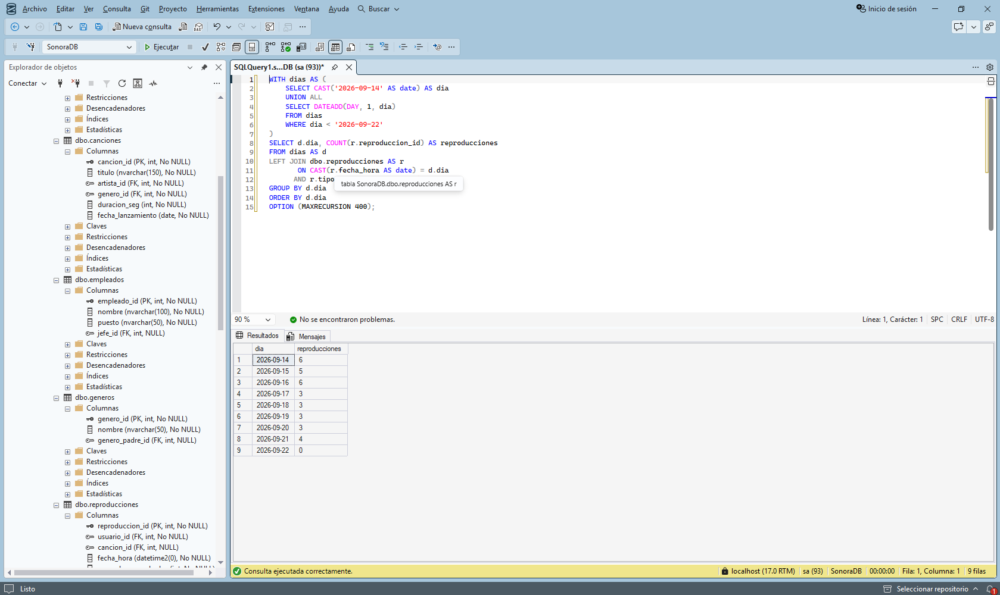

*Figura 18. Ejemplo 13 con CTE recursiva de fechas.*

```sql
SELECT d.dia, COUNT(r.reproduccion_id) AS reproducciones
FROM (SELECT DATEADD(DAY, n.n, CAST('2026-09-14' AS date)) AS dia
      FROM (VALUES (0), (1), (2), (3), (4), (5), (6), (7), (8)) AS n(n)) AS d
LEFT JOIN dbo.reproducciones AS r
       ON CAST(r.fecha_hora AS date) = d.dia
      AND r.tipo_contenido = N'Canción'
GROUP BY d.dia
ORDER BY d.dia;
```

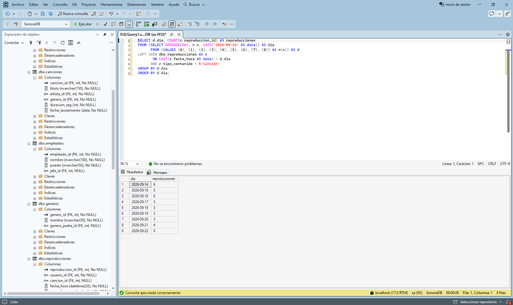

*Figura 19. Ejemplo 13 con una lista VALUES.*


### 4.6 Ejemplo 14. CTE frente a subconsulta

Busca los usuarios cuyos segundos escuchados de canciones superan la media de todos ellos. La CTE `totales` se usa dos veces, una para listar usuarios y otra para calcular la media, y aparecen juanpi con 1719 y alexbeats con 1038 sobre una media de 904 (Figura 20). Sin CTE hay que repetir la tabla derivada completa en las dos posiciones (Figura 21). La CTE evita esa repetición, aunque el motor la evalúa igualmente en cada uso, porque no se materializa.

```sql
WITH totales AS (
    SELECT usuario_id, SUM(segundos_escuchados) AS segundos
    FROM dbo.reproducciones
    WHERE tipo_contenido = N'Canción'
    GROUP BY usuario_id
)
SELECT u.nombre_usuario,
       t.segundos,
       (SELECT AVG(segundos) FROM totales) AS media_usuarios
FROM totales AS t
JOIN dbo.usuarios AS u ON u.usuario_id = t.usuario_id
WHERE t.segundos > (SELECT AVG(segundos) FROM totales)
ORDER BY t.segundos DESC;
```

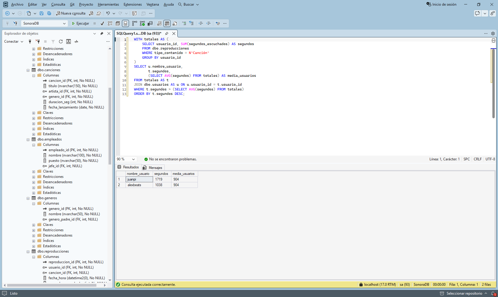

*Figura 20. Ejemplo 14 con CTE reutilizada dos veces.*

```sql
SELECT u.nombre_usuario, t.segundos
FROM (SELECT usuario_id, SUM(segundos_escuchados) AS segundos
      FROM dbo.reproducciones
      WHERE tipo_contenido = N'Canción'
      GROUP BY usuario_id) AS t
JOIN dbo.usuarios AS u ON u.usuario_id = t.usuario_id
WHERE t.segundos > (SELECT AVG(t2.segundos)
                    FROM (SELECT usuario_id, SUM(segundos_escuchados) AS segundos
                          FROM dbo.reproducciones
                          WHERE tipo_contenido = N'Canción'
                          GROUP BY usuario_id) AS t2)
ORDER BY t.segundos DESC;
```

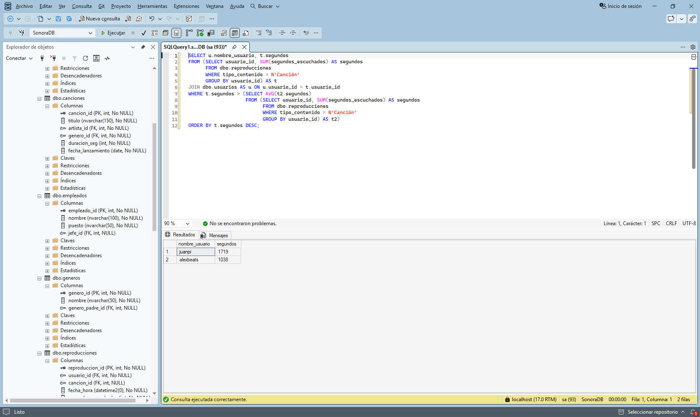

*Figura 21. Ejemplo 14 con tablas derivadas repetidas.*


## 5. SonoraDB: ejercicios de refuerzo


### 5.1 Ejercicio 1. Subconsulta escalar

Canciones más largas que la más larga de Luna Roja. La subconsulta escalar obtiene esa duración máxima uniendo `canciones` con `artistas` por `artista_id` y filtrando por el nombre. Salen 6 canciones, de Fábrica 4AM (412 s) a Rimas de Barrio (214 s) (Figura 22).

```sql
SELECT titulo, duracion_seg
FROM dbo.canciones
WHERE duracion_seg > (SELECT MAX(c.duracion_seg)
                      FROM dbo.canciones AS c
                      JOIN dbo.artistas AS a ON a.artista_id = c.artista_id
                      WHERE a.nombre = N'Luna Roja')
ORDER BY duracion_seg DESC;
```

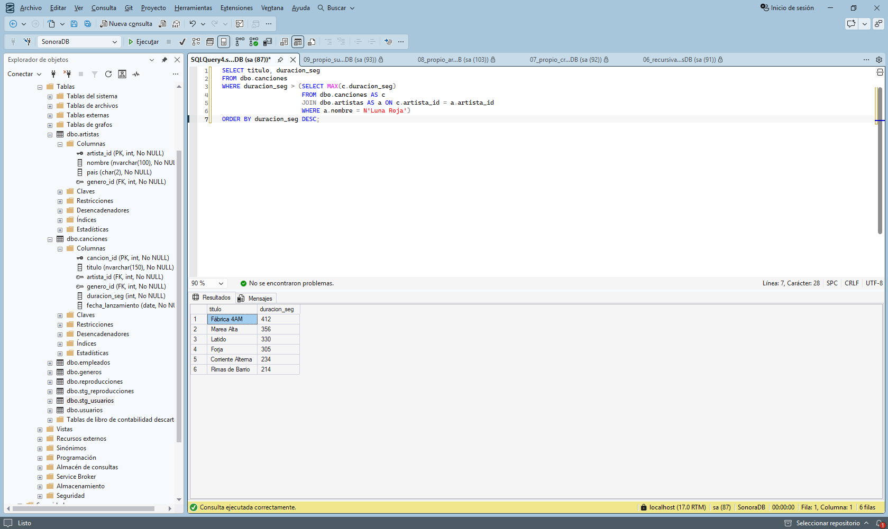

*Figura 22. Ejercicio 1: canciones más largas que la más larga de Luna Roja.*


### 5.2 Ejercicio 2. Subconsulta de lista

Canciones reproducidas alguna vez desde un Smart TV. El dispositivo está en `reproducciones`, no en `canciones`, así que el `IN` toma de ahí los `cancion_id`. Salen cuatro títulos (Figura 23).

```sql
SELECT titulo
FROM dbo.canciones
WHERE cancion_id IN (SELECT cancion_id
                     FROM dbo.reproducciones
                     WHERE dispositivo = N'Smart TV')
ORDER BY titulo;
```

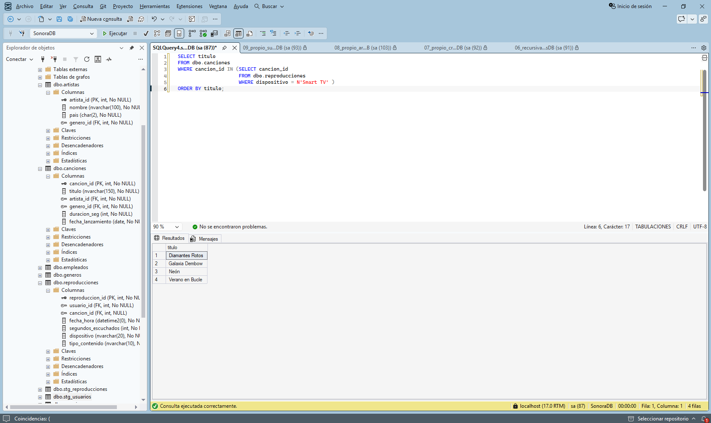

*Figura 23. Ejercicio 2: canciones reproducidas desde un Smart TV.*


### 5.3 Ejercicio 3. NOT EXISTS

Artistas sin ninguna canción. La subconsulta se correlaciona con `c.artista_id = a.artista_id`, que une la clave foránea de `canciones` con la clave primaria de `artistas`. Solo aparece Sara Cometa (Figura 24).

```sql
SELECT a.nombre
FROM dbo.artistas AS a
WHERE NOT EXISTS (SELECT 1
                  FROM dbo.canciones AS c
                  WHERE c.artista_id = a.artista_id);
```

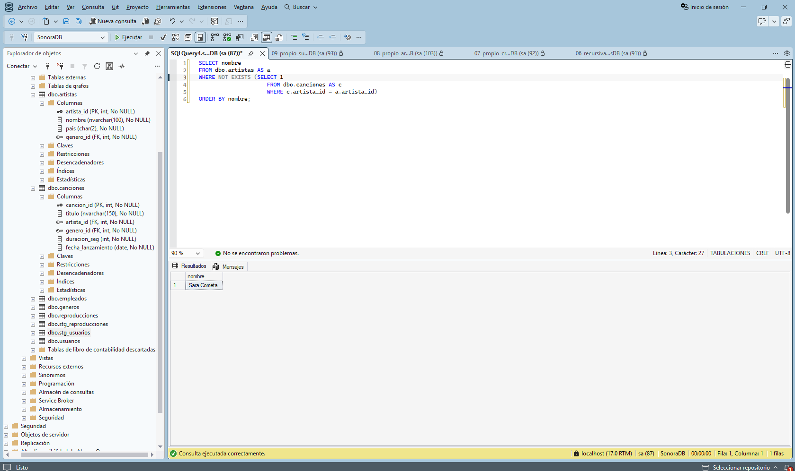

*Figura 24. Ejercicio 3: artistas sin canciones, con NOT EXISTS.*


### 5.4 Ejercicio 4. EXISTS

Usuarios que han escuchado al menos un anuncio. Un anuncio es una reproducción con `tipo_contenido = N'Anuncio'`. Aparecen dani_dj, marta_rock y nachox, los tres con plan Free (Figura 25).

```sql
SELECT u.nombre_usuario, u.plan_suscripcion
FROM dbo.usuarios AS u
WHERE EXISTS (SELECT 1
              FROM dbo.reproducciones AS r
              WHERE r.usuario_id = u.usuario_id
                AND r.tipo_contenido = N'Anuncio')
ORDER BY u.nombre_usuario;
```

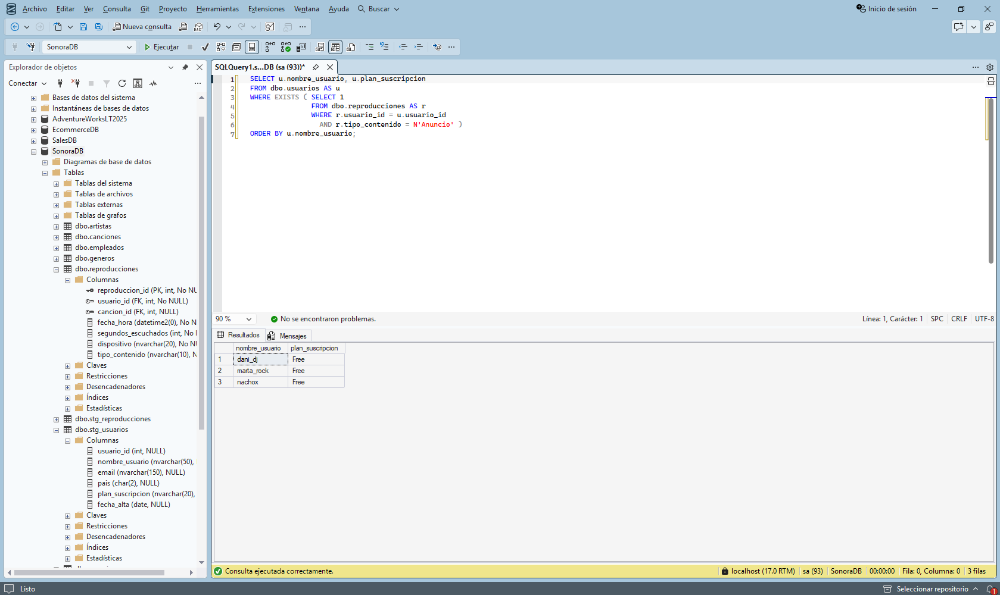

*Figura 25. Ejercicio 4: usuarios que han escuchado un anuncio, con EXISTS.*


### 5.5 Ejercicio 5. Tabla derivada y CTE

Usuarios con 4 o más reproducciones válidas. En la primera versión la tabla derivada cuenta por usuario y la consulta externa la une con `usuarios` (Figura 26). En la segunda, la misma consulta se mueve a una CTE y queda más legible (Figura 27). Hay que escribir `N'Canción'` con tilde y con el prefijo `N`: sin la tilde la condición no coincide con ningún dato y la consulta devuelve 0 filas sin dar error.

```sql
SELECT u.nombre_usuario, t.reproducciones_validas
FROM (SELECT usuario_id, COUNT(*) AS reproducciones_validas
      FROM dbo.reproducciones
      WHERE tipo_contenido = N'Canción'
        AND segundos_escuchados >= 30
      GROUP BY usuario_id) AS t
JOIN dbo.usuarios AS u ON u.usuario_id = t.usuario_id
WHERE t.reproducciones_validas >= 4
ORDER BY t.reproducciones_validas DESC, u.nombre_usuario;
```

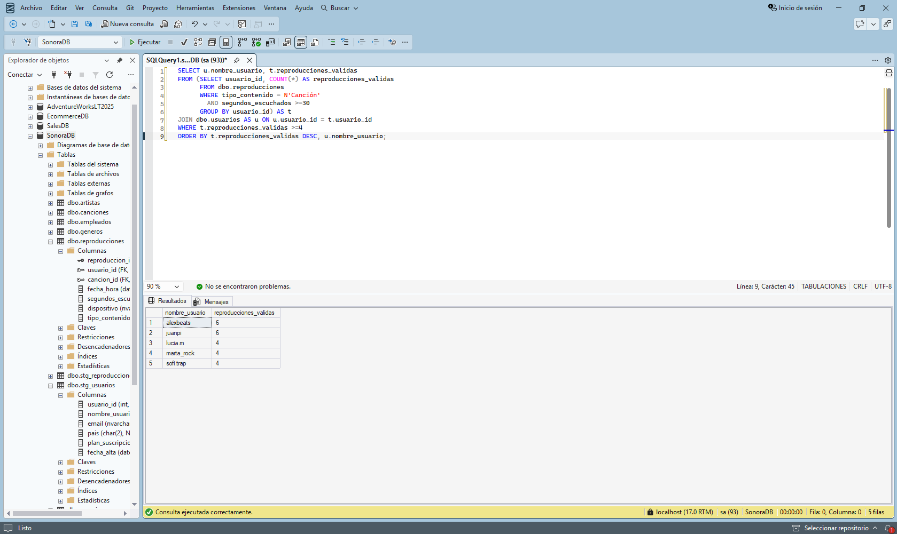

*Figura 26. Ejercicio 5 con tabla derivada.*

```sql
WITH validas AS (
    SELECT usuario_id, COUNT(*) AS reproducciones_validas
    FROM dbo.reproducciones
    WHERE tipo_contenido = N'Canción'
      AND segundos_escuchados >= 30
    GROUP BY usuario_id
)
SELECT u.nombre_usuario, v.reproducciones_validas
FROM validas AS v
JOIN dbo.usuarios AS u ON u.usuario_id = v.usuario_id
WHERE v.reproducciones_validas >= 4
ORDER BY v.reproducciones_validas DESC, u.nombre_usuario;
```

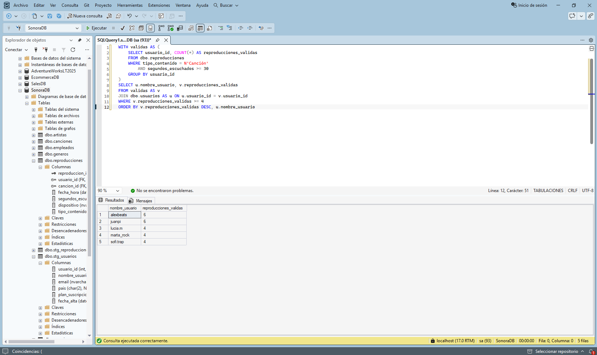

*Figura 27. Ejercicio 5 con CTE.*


### 5.6 Ejercicio 6. Correlacionada y lista

Título y total de reproducciones de las canciones de Nébula y DJ Coral, incluidas las que no tienen ninguna. El conteo es una subconsulta correlacionada en el `SELECT` y los artistas se filtran con un `IN` por nombre. Latido sale con 0 (Figura 28).

```sql
SELECT c.titulo,
       (SELECT COUNT(*)
        FROM dbo.reproducciones AS r
        WHERE r.cancion_id = c.cancion_id) AS total_reproducciones
FROM dbo.canciones AS c
WHERE c.artista_id IN (SELECT artista_id
                       FROM dbo.artistas
                       WHERE nombre IN (N'Nébula', N'DJ Coral'))
ORDER BY total_reproducciones DESC, c.titulo;
```

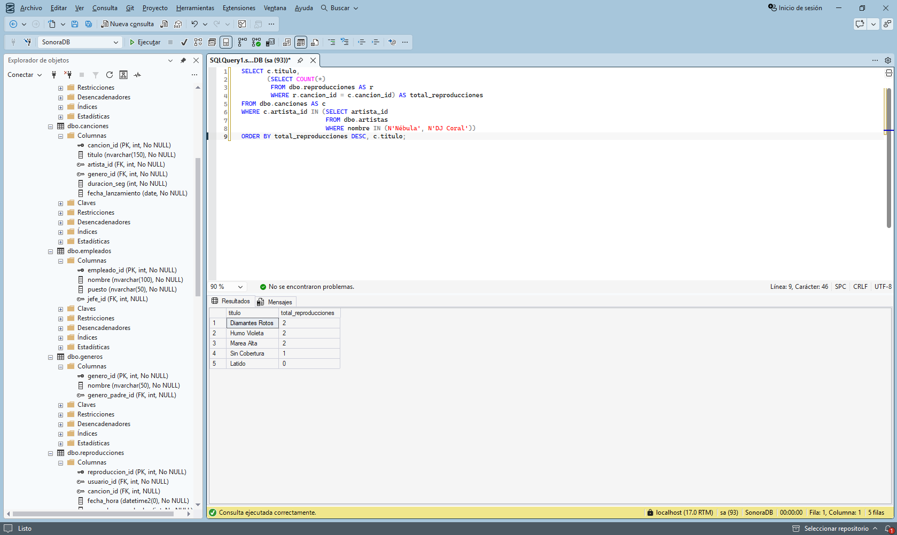

*Figura 28. Ejercicio 6: reproducciones por canción de Nébula y DJ Coral.*


### 5.7 Ejercicio 7. Por qué falla NOT IN

La consulta del compañero devuelve 0 filas porque la subconsulta incluye valores `NULL`. Los anuncios tienen `cancion_id` nulo, y `cancion_id NOT IN (..., NULL)` se evalúa como desconocido para toda canción, así que ninguna fila cumple la condición. No hay error ni aviso. Con `NOT EXISTS` se comprueba si existe alguna reproducción de un usuario Free para cada canción, y los nulos no intervienen. Salen siete títulos (Figura 29).

```sql
SELECT c.titulo
FROM dbo.canciones AS c
WHERE NOT EXISTS (SELECT 1
                  FROM dbo.reproducciones AS r
                  JOIN dbo.usuarios AS u ON u.usuario_id = r.usuario_id
                  WHERE r.cancion_id = c.cancion_id
                    AND u.plan_suscripcion = N'Free')
ORDER BY c.titulo;
```

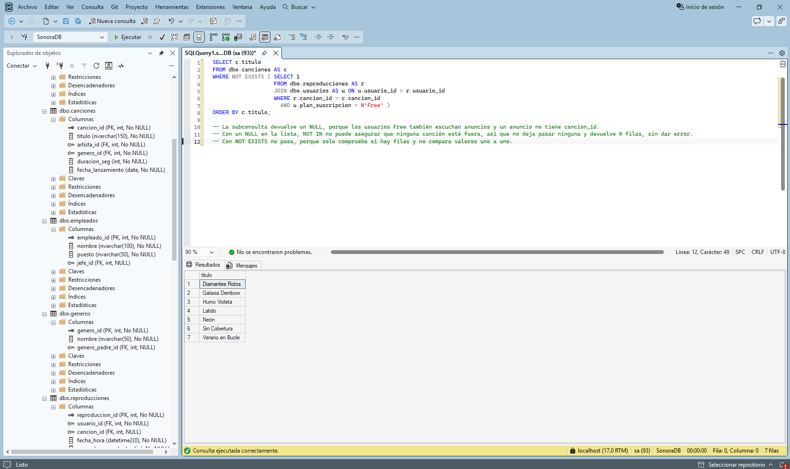

*Figura 29. Ejercicio 7: NOT EXISTS sobre los usuarios Free.*


### 5.8 Ejercicio 8. Carga idempotente

Primero escribí la consulta que identifica los usuarios de `stg_usuarios` que no están en `usuarios`: pau.synth (9) y kiara_perreo (10). Después la convertí en un `INSERT ... SELECT` con la misma condición `NOT EXISTS` y comprobé que `usuarios` pasaba a 10 filas (Figura 30). Para demostrar que es idempotente borré los usuarios 9 y 10 y ejecuté la carga dos veces. La primera inserta 2 filas (Figura 31) y la segunda 0 (Figura 32).

```sql
SELECT s.usuario_id, s.nombre_usuario, s.plan_suscripcion
FROM dbo.stg_usuarios AS s
WHERE NOT EXISTS (SELECT 1
                  FROM dbo.usuarios AS u
                  WHERE u.usuario_id = s.usuario_id);
```

```sql
INSERT INTO dbo.usuarios (usuario_id, nombre_usuario, email, pais, plan_suscripcion, fecha_alta)
SELECT s.usuario_id, s.nombre_usuario, s.email, s.pais, s.plan_suscripcion, s.fecha_alta
FROM dbo.stg_usuarios AS s
WHERE NOT EXISTS (SELECT 1
                  FROM dbo.usuarios AS u
                  WHERE u.usuario_id = s.usuario_id);
```

```sql
SELECT COUNT(*) AS usuarios FROM dbo.usuarios;
```

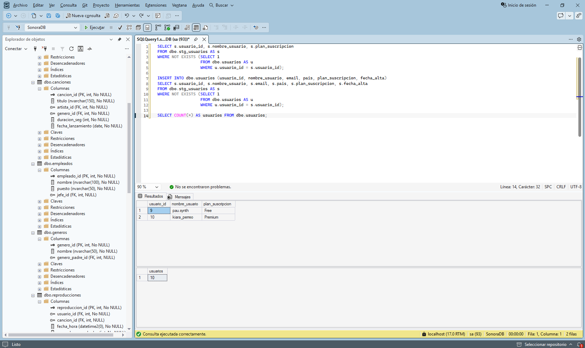

*Figura 30. Ejercicio 8: consulta previa, carga y recuento final (10 usuarios).*


*Figura 31. Ejercicio 8: primera ejecución del INSERT, 2 filas afectadas.*

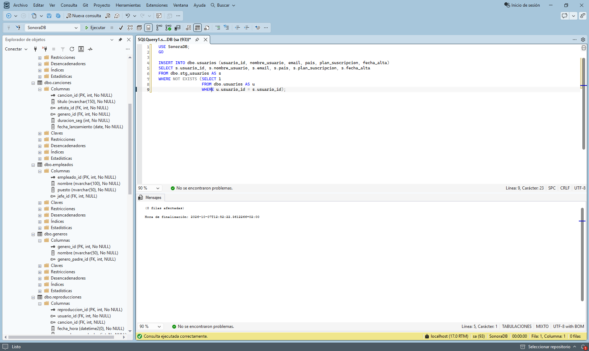

*Figura 32. Ejercicio 8: segunda ejecución del INSERT, 0 filas afectadas.*


### 5.9 Ejercicio 9. Pipeline de tres CTE

Música válida por país y plan. La primera CTE limpia (solo canciones con 30 segundos o más), la segunda enriquece con el país y el plan del usuario y la tercera agrega el número de reproducciones y los minutos con un decimal. Se divide entre `60.0` para evitar la división entera. MX Premium sale con 28,7 minutos, porque 1719 entre 60 es 28,65 y se redondea a 28,7 (Figura 33).

```sql
WITH limpias AS (
    SELECT usuario_id, segundos_escuchados
    FROM dbo.reproducciones
    WHERE tipo_contenido = N'Canción'
      AND segundos_escuchados >= 30
),
enriquecidas AS (
    SELECT u.pais, u.plan_suscripcion, l.segundos_escuchados
    FROM limpias AS l
    JOIN dbo.usuarios AS u ON u.usuario_id = l.usuario_id
),
agregadas AS (
    SELECT pais, plan_suscripcion,
           COUNT(*) AS reproducciones,
           CAST(SUM(segundos_escuchados) / 60.0 AS decimal(6,1)) AS minutos
    FROM enriquecidas
    GROUP BY pais, plan_suscripcion
)
SELECT pais, plan_suscripcion, reproducciones, minutos
FROM agregadas
ORDER BY minutos DESC;
```

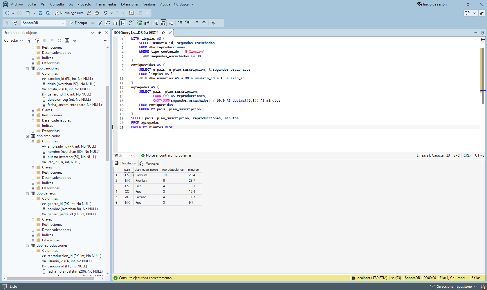

*Figura 33. Ejercicio 9: pipeline de tres CTE.*


### 5.10 Ejercicio 10. Organigrama

CTE recursiva sobre `empleados`. El ancla es el CEO (`jefe_id IS NULL`), con nivel 0 y su nombre como ruta. La parte recursiva añade un nivel y concatena el nombre a la ruta, convertida a `nvarchar(400)` en el ancla. Salen 10 filas ordenadas por ruta (Figura 34).

```sql
WITH organigrama AS (
    SELECT empleado_id, nombre, puesto,
           0 AS nivel,
           CAST(nombre AS nvarchar(400)) AS ruta
    FROM dbo.empleados
    WHERE jefe_id IS NULL

    UNION ALL

    SELECT e.empleado_id, e.nombre, e.puesto,
           o.nivel + 1,
           CAST(o.ruta + N' > ' + e.nombre AS nvarchar(400))
    FROM dbo.empleados AS e
    JOIN organigrama AS o ON e.jefe_id = o.empleado_id
)
SELECT nombre, puesto, nivel, ruta
FROM organigrama
ORDER BY ruta;
```

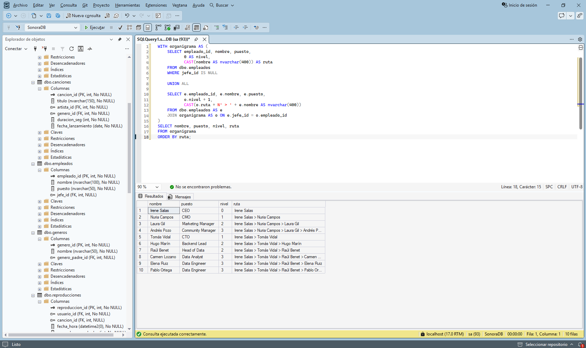

*Figura 34. Ejercicio 10: organigrama con CTE recursiva.*


### 5.11 Ejercicio 11. Subgéneros a cualquier profundidad

La CTE parte del género por nombre, Urbano, y baja por `genero_padre_id`. Después se unen sus géneros con `canciones` y `artistas`. Salen 7 canciones, entre ellas Galaxia Dembow, que cuelga de Reguetón y por tanto está a dos niveles de Urbano (Figura 35).

```sql
WITH subgeneros AS (
    SELECT genero_id, nombre
    FROM dbo.generos
    WHERE nombre = N'Urbano'

    UNION ALL

    SELECT g.genero_id, g.nombre
    FROM dbo.generos AS g
    JOIN subgeneros AS s ON g.genero_padre_id = s.genero_id
)
SELECT c.titulo, s.nombre AS genero, a.nombre AS artista
FROM subgeneros AS s
JOIN dbo.canciones AS c ON c.genero_id = s.genero_id
JOIN dbo.artistas  AS a ON a.artista_id = c.artista_id
ORDER BY s.nombre, c.titulo;
```

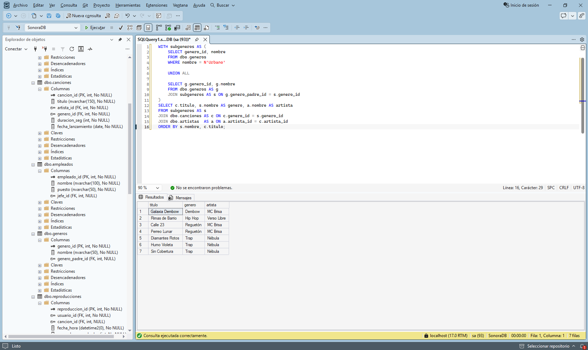

*Figura 35. Ejercicio 11: canciones del género Urbano y sus subgéneros.*


### 5.12 Ejercicio 12. Área del CTO

El ancla son los subordinados directos de Tomás Vidal, obtenido con una subconsulta escalar sobre su nombre, con nivel 1. La parte recursiva baja por `jefe_id`. El propio CTO no aparece y salen 5 personas (Figura 36).

```sql
WITH area AS (
    SELECT empleado_id, nombre, puesto, 1 AS nivel
    FROM dbo.empleados
    WHERE jefe_id = (SELECT empleado_id FROM dbo.empleados WHERE nombre = N'Tomás Vidal')

    UNION ALL

    SELECT e.empleado_id, e.nombre, e.puesto, a.nivel + 1
    FROM dbo.empleados AS e
    JOIN area AS a ON e.jefe_id = a.empleado_id
)
SELECT nombre, puesto, nivel
FROM area
ORDER BY nivel, nombre;
```

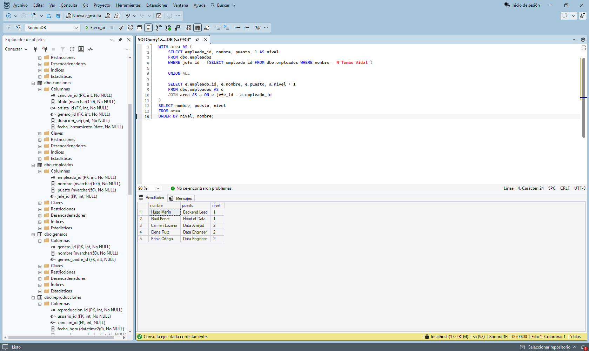

*Figura 36. Ejercicio 12: área del CTO con nivel relativo.*


## 6. Puntos a tener en cuenta

En una CTE recursiva la columna que se va construyendo, como la ruta, debe tener el mismo tipo en el ancla y en la parte recursiva. Por eso se usa `CAST` en el ancla. Sin él, SQL Server da el error 240.

`MAXRECURSION` vale 100 por defecto. Una recursión más profunda produce el error 530. Con `OPTION (MAXRECURSION n)` se amplía, y con 0 se quita el límite, algo peligroso si la condición de parada falla.

Una CTE no se materializa. Si se usa dos veces, el motor la evalúa dos veces. Sirve para legibilidad y reutilización de código, no para guardar resultados.

`NOT IN` con una subconsulta que devuelve `NULL` da cero filas sin avisar. `NOT EXISTS` no tiene ese problema.

Dividir entre `60.0` y no entre `60` evita que el motor haga una división entera y pierda los decimales.

Las alternativas con subconsultas a una CTE recursiva solo sirven si se conoce la profundidad. Una CTE recursiva resuelve el caso general.


## 7. Scripts SQL incluidos

La carpeta `sql/` tiene dos subcarpetas. En `salesdb/` están los scripts de la primera parte y en `sonora/` los de la segunda, numerados en el orden de ejecución. Todos empiezan con `USE` de su base de datos. El script `00_crear_salesdb.sql` es la reconstrucción de SalesDB y se ejecuta conectado a master.

*Tabla 3. Scripts de la carpeta sql/salesdb/.*

| Script | Contenido |
|---|---|
| 00_crear_salesdb.sql | Creación de SalesDB con Customers, Orders y Employees |
| 01_comprobar_bd.sql | Comprobación de la base y recuento de filas |
| 02_cte_no_recursiva.sql | CTE no recursiva con cuatro CTE |
| 03_recursiva_serie_1_20.sql | Serie recursiva del 1 al 20 |
| 04_recursiva_error_maxrecursion.sql | Error 530 con el límite por defecto |
| 05_recursiva_serie_1_1000.sql | Serie del 1 al 1000 con MAXRECURSION |
| 06_recursiva_jerarquia.sql | Jerarquía de empleados |
| 07_propio_crear_tabla.sql | Tabla Generos del ejemplo propio |
| 08_propio_arbol_completo.sql | Árbol completo con nivel y ruta |
| 09_propio_subarbol.sql | Subárbol de Electrónica |

*Tabla 4. Scripts de la carpeta sql/sonora/.*

| Script | Contenido |
|---|---|
| 19 a 30 | Ejemplos 9 a 14: versión con CTE y versión con subconsultas |
| 31 a 34 | Ejercicios 1 a 4 |
| 35 y 36 | Ejercicio 5, con tabla derivada y con CTE |
| 37, 38 | Ejercicios 6 y 7 |
| 39 a 41 | Ejercicio 8: consulta, INSERT y recuento |
| 42 a 45 | Ejercicios 9 a 12 |
